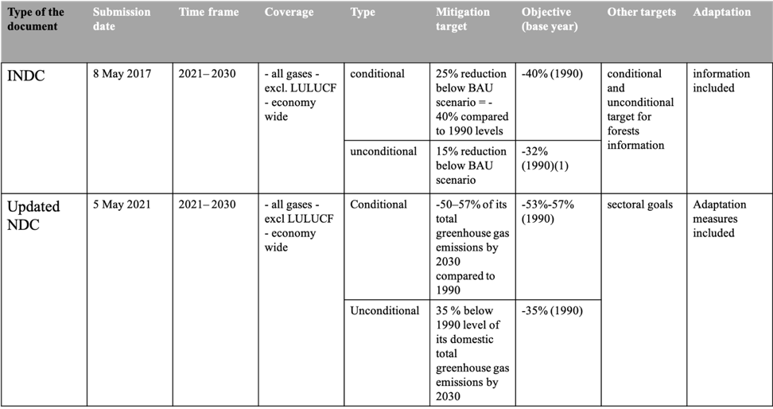

```{r setup, include=FALSE}
knitr::opts_chunk$set(echo = FALSE)

library(ggplot2)
library(tidyverse)
library(viridis)
library(collapsibleTree)
library(treemapify)


# Learn more about creating blogs with Distill at:
# https://rstudio.github.io/distill/blog.html

```


*This project is part of the International Climate Initiative (IKI). The Federal Ministry for the Environment, Nature Conservation and Nuclear Safety (BMU) supports this initiative on the basis of a decision adopted by the German Bundestag.*

**Disclaimer **

*The views expressed in this information product do not necessarily reflect the views or policies either of the BUND, nor Ivane Javakhishvili Tbilisi State University. It is published under the responsibility of the authors.*


**Acknowledgement**  

*The authors would like to thank interview partners and survey respondents for their time, engagement and contribution. Special thanks go to Severin Ettl for his valuable comments and suggestions during the whole study.*


**Funding**


*This project is part of the [International Climate Initiative (IKI)](https://www.international-climate-initiative.com/en?iki_cookie_check=1).  [The Federal Ministry for the Environment, Nature Conservation and Nuclear Safety (BMU)](https://www.bmu.de/en/) supports this initiative on the basis of a decision adopted by the German Bundestag. The study is commissioned by [Bund für Umwelt und Naturschutz Deutschland e.V. (BUND)](https://www.bund.net/).*


## Preface

**Natalia Davlianidze, MA.**

*External Reviewer*

*Development Geographer, Sustainable Development Researcher, and Policy Specialist Tbilisi, Georgia*

*March 2022*

Human interactions with the earth system are complex. The global human population, economic productivity, energy consumption, and ongoing global environmental change are all greatly intertwined. At the historic *Nobel Prize Summit 2021: Our Planet, Our Future*, the Nobel laureates and other experts called for urgent action for planetary stewardship. The growing population, urbanization, and increasing consumption will be causing increased demand for resources and infrastructure development which will be an energy- and emissions- intensive endeavor unless significant changes are implemented. Georgia is not an exception, and we now know that, for example, the demand for electricity in Georgia has been steadily growing in the past decade, at an average 4% rate per year^[Our Planet, Our Future. An Urgent Call for Action. April 29, 2021. Retrieved from: <https://www.nationalacademies.org/news/2021/04/nobel-prize-laureates-and-other-experts-issue-urgent-call-for-action-after-our-planet-our-future-summit> (11/03/2022)]. This has been raising the questions of energy security, energy equity, and environmental sustainability at the local level.

To avoid the devastating impacts of climate change, the world will need to collectively and proactively embark on a path to net-zero emissions. One positive step forward is UNFCCC member states' overwhelming engagement in the process. By the end of COP26, 194 parties submitted their NDCs, and 13 had submitted their second NDCs^[UNFCCC. NDC Registry. Retrieved from: <https://www4.unfccc.int/sites/NDCStaging/Pages/All.aspx> (11/03/2022)
]. Yet, the updated NDC Synthesis Report suggests that parties need to be more ambitious in their NDCs if we aim to achieve the Paris Agreement goal of below 2°C or ideally 1.5°C by the end of the century^[Nationally determined contributions under the Paris Agreement. Revised synthesis report by the secretariat. Retrieved from: <https://unfccc.int/documents/307628> (11/03/2022)].

Notably, considering global inequalities in socio-economic development, the severe impacts of climate change will produce uneven consequences, whereas those who contributed the least to the GHG emissions will experience the impacts more profoundly. Hence, the questions of climate justice and subsequently a just transition arise. Small UNFCCC member countries such as Georgia have an important role in this process. However, active observation of the post-Paris Agreement developments at the national levels and production of local evidence in the lead-up to the next global stocktake is critical. It is precisely due to this reason that the following report is a significant contribution to our understanding of climate justice and Georgia's handling of its climate change policies.

In the following report, the authors describe key processes shaping the new regime in climate governance as well as reflect on Georgia's position and progress within the agreed-upon system. The authors delineate the steps Georgia will be undertaking as a party to Paris Agreement on a pathway to meet the country's commitments outlined in the updated NDCs. Further, the report presents core findings of the study carried out throughout the summer and the fall of 2021. The authors have studied links between climate justice and NDCs in Georgia. The report outlines key findings of the study in two primary directions (1) review of the policy documents and (2) case study outcomes. Both components support the cross-examination of findings.

Following the mixed-method approach, the research team has undertaken multiple steps to ensure the delivery of robust and reliable findings in this report. The authors studied strategic policy documents on the national and municipal levels and reported on incorporating the NDC and ETF requirements in these documents. In the first part of the study, the research team has also interviewed selected stakeholders from governmental agencies, NGOs, CSOs, international donor organizations, local municipalities, and private sector representatives. At a later stage, multiple stakeholders completed questionnaires, as a result, complementing the findings from the qualitative component and providing additional insights. Lastly, the team has conducted meetings and site visits to develop a case study in Telavi, a municipality with ongoing renewable energy projects. The researchers did a profound job reviewing the study design process and deployed methods, enabling future replication of the study.

In Chapter 3, the authors did an excellent job reporting on the key findings of the in-depth interviews and survey results, as well as a systematic literature review (SLR). The authors have clarified several of the questions and provided an insightful analysis of Georgia's NDCs and, most importantly, the examination of financial allocations that support the implementation of NDGs as well as efforts (or lack thereof) to ensure localization of NDCs. Furthermore, a brief analysis of the reporting requirements under the Enhanced Transparency Framework (ETF) and the Biennial Transparency Reports (BTR) makes this report useful not just for the policymakers and development practitioners but for academics and students who want to get a better sense of the Paris Agreement follow up processes in the country. Chapter 4 is entirely devoted to the reporting on the two case studies. Selected sites were LOPOTA 1 HPP and the project on energy-efficient kindergartens in Telavi municipality. Both cases are within the same administrative unit but present different outcomes of energy project implementation. If brought to the attention of relevant stakeholders, these cases provide valuable insights on the importance of civic participation, multi-stakeholder planning, and the implementation of energy policies and projects.

Despite the rather small spatial and temporal extent of the study, it should make an important contribution to both academics and practitioners working at the climate-energy nexus. Nevertheless, as well pointed out by the authors, due to evolving nature of the processes in the country, this work will need further revisions as Georgia progresses in its efforts to develop new policies and factor NDC commitments in the national documents. In addition, further exploratory studies examining the cases from other regions of Georgia with different socio-economic backgrounds and contexts will be a valuable contribution for creating a better understanding of existing spatial disparities and possible areas of cooperation between central and decentralized actors.

Moving forward, more applied and place-based research is needed to further enrich our understanding of the local climate change context. Yet, such research is not an easy undertaking, especially in transitional economies such as Georgia. Led by a young generation of local researchers and academics, this report will present one attempt to diversify climate conversation in Georgia beyond policymakers' meeting rooms. For understanding the value of such research on the ground and supporting its implementation by the local research team, a special acknowledgment is due to BUND.


## Chapter 1. Introduction

The United Nations Framework Convention on Climate Change (UNFCCC) was designed as a framework convention agreed on an all-inclusive global treaty: the Paris Agreement. The ultimate objective of the convention is to stabilize greenhouse gas concentrations "at a level that would prevent dangerous anthropogenic (human-induced) interference with the climate system." (Article 2). Negotiations under this framework evolved over time, based on the emergence of new scientific evidence, social understandings, and political changes. The UNFCCC adopted the convention-protocol approach, through which the institutional framework is established under the convention, and commitments are agreed upon through subsequent protocols [@Kuyper2018]. These are major milestones since the convention's adoption, including the Kyoto Protocol's adoption in 1997 and the Paris Agreement in 2015 [@Kuyper2018]. Georgia has been a party to the convention since 1994. Georgia ratified the Kyoto Protocol^[https://matsne.gov.ge/ka/document/view/116986?publication=0] in 1999 and the Paris Agreement^[https://matsne.gov.ge/ka/document/view/3262353?publication=0] in 2017. 

Article 3 of the Convention states: “Parties should protect the climate system based on equity and following their common but differentiated responsibilities [@UnitedNations1992]. The inclusion of the Common but Differentiated Responsibilities (CBDRs) principle in the climate regime established several concepts. First, it recognized states’ responsibility to protect the global environment. Second, it was built on the acknowledgment that industrial countries bear the primary responsibility for causing “global warming,” which determined their level of responsibility based on their historical contributions. Third, it coined the distinction between the member states based on their economic development [@Stone2004]. Despite the ambiguity of its legal status, it still became a guiding concept within the contemporary climate regime structure. CBDR is mentioned in the primary operative text of the Convention and also in the preamble of the Kyoto Protocol to the Convention. It has significant legal weight to form the legal basis for interpreting existing obligations and differentiated responsibilities [@Rajamani2000]. The Kyoto Protocol continued this line by committing industrialized countries and economies in transition to limit and reduce greenhouse gases (GHG) emissions under agreed individual targets [@VonStein2008]. The Kyoto Protocol only binds developed countries, and places a heavier burden on them under the principle, because it recognizes that they are primarily responsible for the current high levels of GHG emissions in the atmosphere [@WhatistheKyotoProtocol]. However, the landscape in climate governance has changed since then, as the interest and importance of adaptation and finance were put forward coupled with the rapid economic growth in the countries with transition economies, causing the drastic increase in the emissions across the globe [@Enerdata2021]. 

Consequently, the Paris agreement shifted from the binary approach towards differentiation and urged for a “global ambition” goal of “holding the increase in global average temperature to well below 2◦C above pre-industrial levels” and “pursuing efforts” to limit it to 1.5◦C[@UnitedNations2015]. Article 4.2 of the Paris agreement requires the countries to prepare, communicate, and maintain the successive NDCs it intends to achieve. Parties shall pursue domestic mitigation measures to achieve the objectives of such contributions. As a party to the UNFCCC and the Paris Agreement, Georgia took the commitment and submitted its Intended Nationally Determined Contribution (INDC) in 2016, which aimed at reducing GHG emissions to 40% by 2030 compared to 1990 levels [@GovernmentofGeorgia2016]. Abiding by the encouragement from the Convention to resubmit a more ambitious NDC by 2020, Georgia submitted its updated NDC in 2021.

As mentioned above, the Paris Agreement created a new regime in climate governance. The Paris Agreement established an Enhanced Transparency Framework (ETF) designed to build trust and confidence that all countries contribute their share to the global effort. This regime is strengthened through the Paris rulebook, which has been negotiated after the adoption of the Paris Agreement. The rulebook establishes procedures and guidelines to enforce the agreement. They are referred to as Modalities, Procedures, and Guidelines (MPGs) of the Paris Agreement. Countries have a common set of guidelines and processes. Flexibility is provided for those countries with a transition economy that needs it in light of their capacities, but the specific provisions in the guidelines bound this flexibility. The general requirements under the ETF are set forward in article 13 of the Paris agreement, which stipulates the need for transparency of action and support. It obliges parties to submit information on the national GHG inventories and progress towards implementing and achieving NDCs and on climate change impacts and adaptation as appropriate. Even though the Paris agreement has diverted from a straight binary approach, it distinguishes the reporting on financial matters between the developing and developed countries. The developed country parties are obliged to report on financial, technology transfer, and capacity-building support provided and mobilized.

On the other hand, developing country parties do not have such strict obligations, but they should report on financial, technology transfer, and capacity-building support needed and received. Under the ETF, all parties undergo Technical Expert Review on the information submitted under article 13.7 and facilitative, multilateral consideration of progress on the implementation of article 9. The developing country parties (in this case Georgia) will receive financial support from Global Environmental Facility to prepare their biannual transparency reports (articles). Further, the Parties will be given assistance to fulfill their reporting requirements under the Convention from the Consultative Group of Experts, which will also support the implementation of the ETF. 

The ETF established reporting review and consideration processes on the information submitted, which gives the possibility to track the progress made by each country. This shared reporting system provides the opportunity to compare a country’s efforts to its commitments declared in their NDCs. For Georgia, such a reporting mechanism will be the first exercise under the Paris Agreement. To ensure the reporting is comparable and robust, the parties have to develop common reporting tables for their national GHG inventories and common tabular format tables for tracking progress towards NDCs and climate finance. The Parties will also create outlines of the biennial transparency report (BTR), the report of the technical expert review, and the national inventory document. As a party to the convention, Georgia will be required to submit its first BTR and national inventory report, if submitted as a stand-alone report, in accordance with the MPGs, at the latest by 31 December 2024. The ETF represents an essential component of the ambition cycle in the global climate regime by building trust and confidence that countries are taking action to meet their national climate targets in their NDCs under the Paris Agreement [@WorldResourcesInstituteWRI2021]. Furthermore, the information reported in BTRs will inform the global stock take, which will take place in 2024, to assess if the countries are on track with the overall objective of the Paris Agreement and the goal of zero net emissions by 2050 and climate neutrality afterward. The ETF also establishes that countries must prepare a plan on how they intend to improve their reporting over time [@Dagnet2017]. 

Except for the reporting, increased usage of wind, biomass, and solar power, particularly while substituting fossil fuels, is the cornerstone of climate mitigation activities and lowering GHGs [@ChitanavaMaka2021]. With a significant emphasis on hydropower, renewable energy sources are considered a viable answer to Georgia’s energy independence future ^[CIDSE identifies large hydropower projects (more than 10 megawatts are generally categorized as large) as false solutions (CIDSE Internal briefing on Renewable Energy and Energy Access, 2017).] [@CIDSE2017]. The Covenant of Mayors - a large-scale EU effort started in 2008 at the initiative of the European Commission in response to the approval of the EU Climate and Energy Package. It is a mainstream European movement. Alongside other local level movements, comprising local and regional governments agreeing to enhance energy efficiency and renewable energy sources on their territory, which is crucial in the energy transition [@IRENA2018]. Georgia joined the Covenant of Mayors in 2010, and it already has 24 signatory municipalities at three different stages of the process. The initiative became incentive for nine cities to prepare and submit Sustainable Energy (and Climate) Action Plans (SE(C)APs), 14 are in the adhesion phase, and one municipality is in the results monitoring process^[https://www.eumayors.eu/about/covenant-community/signatories.html].

In view of all stated above, in the below-presented chapters, we attempt to analyze how and if the requirements under the NDC and ETF have been translated on a national and municipal level. Moreover, how those requirements can be traced into the local actions. Furthermore, the issue of climate justice in the depletion of renewable energy technologies and sources will be discussed. In the sense that local implementation of some renewable projects has societal consequences, on the other hand, it will be highlighted and further explored in the study.


## Chapter 2. Study Framework and Methodology

### 2.1. Study aim and objectives

Since the International climate commitments need to be translated into national and subnational plans and strategies to achieve desired targets, the project's primary goal is to assess:

-	The traceability/translation of international climate commitments to national and local climate plans;
-	Authorities’ consistency in reporting on the implementation of local and national climate plans;
-	Authorities report on the effects of the implementation of local and national climate action;
-	The traceability/recognition and contribution of community-based renewable energy projects. 


### 2.2. Research design 

The collection and analysis of empirical data and secondary information was carried out within the framework of the proposed mixed methods study design using a synthesis of innovative approaches and traditional methods. A systematic literature review (SLR) was undertaken on existing official governmental documents to obtain in-depth information on the research issue. The research employs in-depth interviews and online survey methods with stakeholders to gather detailed information on the research subjects while considering diverse opinions. MAXQDA, a computer-assisted qualitative data analysis software (CAQDAS), was used to analyze the obtained information.


### 2.3. Data collection and target groups 

Within the specified methodological baseline, empirical data was acquired by combining two methods: in-depth interviews and an online survey. Two types of research instruments were used to obtain empirical data: a discussion plan for interviews and a structured questionnaire for an online survey (see appendix doc. 1 and doc. 2).
The purposive sampling was applied using the maximum variation approach [@Patton2015] for selecting interview partners. The selection of the informants was done in accordance with pre-defined diverse traits:

-	Involvement in international, national, and local climate-related activities; 
-	State and donor institutions supporting the implementation of NDC commitments in Georgia;
-	Regional organizations/associations localizing the NDC commitments in Georgia; 
-	Organizations implementing the RE projects in Georgia;
-	International climate change programs.

By considering these features and based on the fundamental concept of maximum variation sampling, the study acquired more essential insights into a phenomenon by examining it from multiple angles. As a result of the interview partner’s sampling, the study involved (i) governmental agencies, (ii) NGOs, CSOs (iii) international donor organizations, (iv) local municipalities, and (v) private sector representatives.

In addition to the criteria listed above, the interest-influence matrix for NDC stakeholders (see fig. 1) were integrated during the sampling. Such an approach provides the prerequisite to reflect issues from the perspective of actors with different levels of interest and power.


#### In-depth interviews

As previously stated, the first part of the study envisaged an in-depth interview approach that included ten conversations with the selected stakeholders (the number of interviews was determined using saturation, see [@Saunders2018]. The heterogeneous experts were identified and then selected using the purposive sampling technique based on the stakeholder mapping. The interviews resulted in an unfettered and open discussion with the interview partners. Remarkably, the interactions revealed detailed information and extensive disputes from stakeholders on study issues. The average length of each interview was around an hour.
A discussion plan was established specifically for each interview and contained broad subjects related to the interview partner’s expertise, generally, concerning the issues of cooperation, involvement of the stakeholders updating and achieving NDCs, mainstreaming NDCs into national and subnational policies, strategies, and plans, ETF, CAP. 

The interviews were audio-recorded to avoid bias in the research process. Following that, the information obtained was transcribed/redacted. To fulfill the high standards of research ethics and transcribing method, the following principles were covered: To verify transcript against data recording and anonymization [@Kuckartz2014], and transcribe only as much and exactly as the research questions require.

#### Online survey

In the second phase, a questionnaire for an online survey was developed based on the findings of the qualitative approach. The survey used a 5-point scale and multiple-choice questions to allow stakeholders to reply on the following key issues:

-	Policy documents that should reflect Nationally Determined Contributions commitments; 
-	Sectors of the NDC and/or CAP that municipalities should strengthen their mandate and engagement; 
-	Evaluating the availability of required GHG emissions data at national and local levels; 
-	Rating the level of climate mitigation and/or adaptation measures taken by municipalities.

The questionnaire was distributed to the general public to incorporate the most diverse stakeholder groups into the study. The structured information obtained via this technique supported the data obtained through a qualitative component and ensured comprehensive coverage of the study objectives.

Because the survey facilitated the participation of multiple stakeholders, relatively extensive information was gathered, allowing the acquisition of multilateral information on the study themes. 35 stakeholders completed the survey in total.

#### Case studies of renewable energy projects

Case studies were carried out within the study framework in Telavi Municipality, where meetings and visits to specified locations were held in line with the research objectives. The case study area was chosen based on the following pre-established factors:

-	Signatory municipality of the Covenant of Mayors, which submitted the action plan, has the regional coordinator and implemented demonstration projects;
-	Current renewable energy initiatives in the area are viewed as role models for other signatory cities. 

The characteristics mentioned above disqualified some cities at the more basic and intermediate phases of NDC implementation. Finally, the fieldwork captured a wide range of activities focused on a particular research site by selecting Telavi municipality. The first case study showcasing the municipality's energy-efficient kindergartens are role models and outstanding demonstration projects in meeting NDC commitments locally. In particular, the research team visited two kindergartens where energy-efficient solutions are being implemented - thermal refurbishment and heating the kindergartens using biomass from local vineyards. Furthermore, information about the RE project – LOPOTA HPP 1 (less than 6 MW) was gathered, despite the fact that on-site visit was not permitted. The latter case was selected to explore the participatory strategies, social responsibility, and, importantly, social costs of RE projects and the local community in Georgia. 

#### Secondary information 

To analyze if, how, and on what scale the NDCs are reflected in the development strategy documents, systematic analysis was conducted regarding the existing literature materials (the latest policy documents of Georgia’s climate change) (see appendix doc. 3). The selection of the development strategy documents was based on the in-depth interviews and subsequent survey that, in the opinion of stakeholders, should reflect the NDCs. The selection of the documents additionally applied the criteria of when the document was adopted and who adopted the document. This enabled us to cover policy documents, strategic documents, legal acts and local municipal development strategies to showcase diversity and integration at various levels. Ultimately the following documents were selected and organized in the MAXQDA for further analysis. 


### 2.4 Data Analysis

#### Stakeholder Mapping

For implementing the NDC stakeholders mapping, the study first identified them at three levels – international, national, and local. A table was compiled that included all possible stakeholders grouped as the following: Governmental, NGOs, donors, academic institutions/centers, private sector, and local groups (CSOs). Moreover, the collected data on stakeholders were analyzed using a specialized technique such as the Interest - influence matrix [@Reed2009]. More precisely, the study applied a widely used stakeholder mapping tool to categorize them and plot this on an Interest/influence grid. Interestingly, research team members rated each stakeholder on a scale of 1 to 10 based on their capital, influence, importance, and interest.

As a result, the analysis of Interest and influence divided the stakeholders into the following four categories (see Figure 1):

-	Subject (high interest/low influence);
-	Key players (high interest and influence);
-	Crowd (low interest and influence);
-	Context setters (low interest/high influence).

The categorization of the NDC Stakeholders on the Interest–Influence Matrix served as an excellent foundation for selecting interview partners from all four sections. In particular, those with limited opportunity to participate in the process and those with authority to make decisions.


```{r  fig.height = 6, fig.width = 8, dev.args=list(bg='transparent', pointsize=10), fig.cap='Interest-Influence Matrix for NDC Stakeholders'}


Stakeholder <- readr::read_csv("/Users/macbook/Documents/research project/fol_2022/ndcTracker/RNDCTracker/Data/stakeholder_updated.csv",
                                 col_types = cols(Abbreviation = "c",
                                                  Interest = "n",
                                                  Influence = "n",
                                                  Grouped = "c",
                                                  Level = "c"))


Figure1 <- Stakeholder %>%
                           ggplot(aes(Influence, Interest, color=Grouped, group=Grouped)) +
                           geom_vline(xintercept = 5)+
                           geom_hline(yintercept = 5)+
                           theme_classic()+
                           #geom_point(aes(size = Influence),  alpha = 0.6)+
                           geom_point(size = 3, alpha = 0.6)+
                           geom_text(aes(label=Abbreviation), vjust = 0, nudge_y = 0.2, 
                                     show.legend = FALSE, color = "black",
                           data = . %>% filter(Abbreviation %in% c("GIZ", "MEPA", "CoM", 
                                                    "Edu-institutions", "HPP (Small)")))+
                           theme(plot.title=element_text(colour="black", size=16),
                                 legend.position="right")+
                           annotate("text", x = 8, y = 10, label = "Key Players \nEngage & Collaborate")+
                           annotate("text", x = 9, y = 0.5,  label = "Context Setters \nConsult")+
                           annotate("text", x = 0.5, y = 0.5, label = "Crowd \nInform")+
                           annotate("text", x = 1.3, y = 10, label = "Subject \nEmpower & Involve")+
                           scale_y_continuous(breaks=seq(0, 10, 2), limits = c(0,10))+
                           scale_x_continuous(breaks=seq(0, 10, 2),  limits = c(0,10))+
                           scale_color_manual(name = "Stakeholder Type",
                                              labels = c("Academic institutions", "Civil society (Local)", "Donors", "Governmental", "NGO", "Private sector"),
                                              values = c("#4287f5", "#d442f5", "#42f5ce", "#1f6656", "#6e5e1e", "#a34955"),
                                              guide = guide_legend(override.aes = list(size = 5)))+
                           scale_size_continuous(breaks=seq(0, 10, 2), 
                                                 limits = c(0,10), name = "Influence Rate", range = c(-5,10))
  


plotly::ggplotly(Figure1)


```


<div class="warning" style='background-color:#c1c5c7; color: #082d40; border-left: solid #05161f 4px; border-radius: 2px; padding:0.2em;'>
<span>
<p style='margin-top:1em; text-align:center'>
<p style='margin-left:1em;'>

*Source: Climate Change Action Plan for 2021-2023*

*Note: own illustration for the project, author Temur Gugushvili*

</p></span>
</div>

<div class="warning" style='background-color:#c1c5c7; color: #082d40; border-left: solid #05161f 4px; border-radius: 2px; padding:0.2em;'>
<span>
<p style='margin-top:1em; text-align:center'>
<p style='margin-left:1em;'>


</p></span>
</div>


The matrix also depicts the stakeholders who, based on the current legal institutional arrangement should be involved in and contribute to the NDC implementation.

#### Systematic literature review (SLR) 

An SLR was used to analyze the NDC, Climate Action Plan and other Georgia’s development strategy documents; the selected documents were imported and analyzed in the MAXQDA (see appendix doc. 3). The family codes were predefined according to NDCs and overall research purpose. The approach led to track localization of the NDC commitments exploring responsible institutions, financial resources, policy documents, and types of contribution. The following family and sub codes were defined:

-	Policy Documents;
-	NDCs: Mitigation, Adaptation;
-	Responsible institution.

The coded segments were displayed in crosstabulation, MAXMaps, using MAXQDA special mixed-methods and visualization techniques such as Crosstab, code relation browser, and later stage MAXMap. These analysis methods were chosen to explore and provide best possible visualizations of the code intersections, such as national, municipal policy documents and NDCs (see figure 8). 


#### Qualitative and Quantitative data analysis

The MAXQDA software allowed the analysis of the collected empirical data following international standards. Depending on the interview segments, codes and sub-codes were developed, resulting in their merging and generalization at the later analysis stage to analyze the scale of each thematic category and intersections between categories and interview partners. 

The results of the survey were analyzed applying descriptive statistics measure of central tendency and variability and illustrated through various charts using R. All related data and visualizations are available open source at GitHub^[https://github.com/Temurgugu/RNDCTracker].

### 2.5 Ethical Considerations of the research 

Each phase of the research, such as collection, storage, analysis and dissemination of information was implemented in compliance with the ethical standards, which are based on the law of Georgia on Personal Data Protection, law of Georgia on Official Statistics and the American Sociological Association's (ASA's) Code of Ethics. In order to protect the ethical principles, issues of confidentiality were discussed with respondents at the outset of the interviews for obtaining informed consent, which will outline what participation means in practice, how long/where it takes place and what participation involves. Likewise, there were mentioned benefits for participants, how privacy and confidentiality would be maintained, the inclusion and exclusion criteria for the study, any risks, inconvenience or discomfort that could reasonably be expected to result from the study.


## Chapter 3. Study Findings

### 3.1 Updating NDC


<div class="warning" style='background-color:#8dc9b8; color: #69337A; border-left: solid #0d5440 4px; border-radius: 4px; padding:0.7em;'>
<span>
<p style='margin-top:1em; text-align:center'>
<p style='margin-left:1em;'>

**Key points:**

- The significant shift from the INDC document from the NDC includes the growth of conditional and unconditional mitigation targets and the addition of a vital asset of adaptation measure in the current NDC document;
- Remarkably, MEPA was designated as the primary player in the process of developing the NDC document, while GIZ, as a donor organization, played a more facilitative role;
-As for the stakeholder participation process, the findings indicate that this process was improved over prior experiences.

</p></span>
</div>


Georgia's "journey" within the frames of the Paris Agreement started in 2015, when the country initiated the preparation of its INDC. This process was new to everyone and countries were encouraged to submit the document to the UNFCCC secretariat as soon as possible, hence, intergovernmental processes and discussions, including the broad stakeholder engagement process was missed in Georgia. However, the country was able to submit the document within the designated time period for which it was commended by the partner countries back in the time.
The comparison of the INDC and NDC reveals that Georgia modified the country's pledges as follows. Compared to 1990 levels, both conditional and unconditional mitigation objectives grew from 40% to 57% (conditional) and from 32% to 35% (unconditional). The adaptation measure, which was solely included in the previous document in the form of information reflecting the current situation, is an essential addition to the new NDC (see Table 1).





<div class="warning" style='background-color:#c1c5c7; color: #082d40; border-left: solid #05161f 4px; border-radius: 2px; padding:0.2em;'>
<span>
<p style='margin-top:1em; text-align:center'>
<p style='margin-left:1em;'>

*Source: NDC preparation and implementation in EaP countries: Comparative analysis of the first and the updated NDCs in Armenia, Azerbaijan, Belarus, Georgia, Republic of Moldova and Ukraine. https://eu4climate.eu/download/ndc-preparation-and-implementation-in-eap-countries/*  

*Note: own illustration for the project, author Ekaterine Mikadze* 

</p></span>
</div>


The following figure shows in more detail the sectoral targets and the emission levels in the reference year of the updated NDC.

```{r  fig.height = 7, fig.width = 10, dev.args=list(bg='transparent', pointsize=10), fig.cap='Emission levels by sectoral targets'}

#Import data 

CAPIndicators <- readr::read_csv("/Users/macbook/Documents/research project/fol_2022/ndcTracker/RNDCTracker/Data/CAPIndicator.csv",
                                 col_types = cols(Goal = "c",
                                                  GgCO2e = "n",
                                                  Year = "c",
                                                  Period_ge = "c",
                                                  Period_en = "c",
                                                  Source_ge = "c",
                                                  Source_en = "c"))

CAPIndicators <- CAPIndicators %>%
  filter(Period_en != "Reference scenario projection")


CAPIndicatorsgroup <- CAPIndicators %>%
  filter(Period_en == "Historical") %>%
  group_by(Year) %>%
  summarise(total = sum(GgCO2e))


#Visualization 

Figure2 <- ggplot(CAPIndicators, aes(Year, GgCO2e, fill=Goal, group=Goal)) +
  geom_area(alpha=0.6 , size=.5, colour="white")+
  scale_fill_viridis(discrete = T) +
  geom_hline(yintercept = 29500)+
  geom_curve(aes(x = 4.5, y = 35000, xend = 4, yend = 30000),
             arrow = arrow(length = unit(0.03, "npc"), 
                           type="closed"),
             size = 0.2,
             angle = 120)+
  annotate("text", x = 4.95, y = 35000, label = "NDC Unconditional")+
  hrbrthemes::theme_ipsum() +
  theme(axis.title.x = element_text(colour="black", size=11, hjust=0.5),
        axis.title.y = element_text(colour="black", size=11, hjust=0.5),
        axis.text.x=element_text(angle = 90,  hjust=1, size=11, colour="black"),
        axis.text.y=element_text(size=11),
        plot.caption = element_text(size=9, colour="black", hjust=1),
        plot.title=element_text(colour="black", size=14,  hjust=0),
        legend.title=element_text(size=11),
        legend.text=element_text(size=11),
        legend.position="bottom",
        legend.key.width = unit(3, "line"))+
  scale_y_continuous(breaks=seq(-70000, 40000, 7000))


Figure2


```

<div class="warning" style='background-color:#c1c5c7; color: #082d40; border-left: solid #05161f 4px; border-radius: 2px; padding:0.2em;'>
<span>
<p style='margin-top:1em; text-align:center'>
<p style='margin-left:1em;'>

*Source: Georgia's National Climate Change Strategy 2030*

*Note: own illustration for the project, author Temur Gugushvili*

</p></span>
</div>


Based on the abovementioned, it can be concluded that the international commitments are translated into the NDC, while short-term goals are reflected in the National Climate Action Plan. More importantly, than in previous years, the process of translating international commitments at the national level may be regarded as relatively state-owned. Based on the interview with the Deutsche Gesellschaft für Internationale Zusammenarbeit (GIZ) representative, we may conclude that the Ministry of Environment Protection and Agriculture (MEPA) drove the process, and the GIZ played a more facilitative role than was initially anticipated. The government established the Climate Change Council as an independent body with decision-making authority over climate change projects and programs. The council's actions and responsibilities are represented in the council's governing rules.

In comparison with the above outlined fact that the stakeholder engagement process was quite limited during the INDC development, the experience was improved during the preparation of NDC. This is also attested by the fact that the majority of the surveyed stakeholders answered that they were involved in the NDC development process. Although it does not mean that the stakeholders were satisfied with the engagement level, this has been voiced number of times through the meetings organized by GMG within the framework of the project on “Increasing the role of civil society in implementing national climate policies^[For example: Strengthening civil society in the implementation of national climate policy].” 


```{r  fig.height = 6, fig.width = 5, dev.args=list(bg='transparent', pointsize=10), fig.cap='The number of the stakeholders involved in the NDC development process'}

NDCSurvey <- readr::read_csv("/Users/macbook/Documents/research project/fol_2022/ndcTracker/RNDCTracker/Data/ndc_survey.csv")


NDCSurveyScales <- NDCSurvey %>%
                   dplyr::select(Respondents, Organisation_Sector, Stakeholder_Involvement_en, Emission_Data, Municipality_Involvement)


#Stakeholder Involvement 

SummariseStakeholder <- NDCSurveyScales %>%
  group_by(Stakeholder_Involvement_en) %>%
  summarise(Frequency = n())


Figure3  <- ggplot(SummariseStakeholder, aes(Stakeholder_Involvement_en, Frequency)) +
  geom_col(fill = "#2f7578")+
  theme_bw()+
  theme(axis.title.x = element_text(colour="black", size=12, hjust=0.5),
        axis.title.y = element_text(colour="black", size=12, hjust=0.5),
        axis.text.x=element_text(angle = 0, hjust=0.5, size=12, colour="black"),
        axis.text.y=element_text(angle = 0, hjust=1, size=12, colour="black"),
        plot.caption = element_text(size=10, colour="black", hjust=0),
        legend.position = "bottom",
        legend.text=element_text(colour="black", size=11),
        axis.line = element_line(size = 0.2, colour = "black"))+
  scale_y_continuous(breaks=seq(0, 35, 5), limits = c(0,35))+
  labs(title="",
       subtitle ="",
       x = "",
       y = "Number of Stakeholders")

Figure3
```


<div class="warning" style='background-color:#c1c5c7; color: #082d40; border-left: solid #05161f 4px; border-radius: 2px; padding:0.2em;'>
<span>
<p style='margin-top:1em; text-align:center'>
<p style='margin-left:1em;'>

*Source: The results of the survey implemented for and within the scope of the exploratory study objectives.*

*Note: own illustration for the project, author Temur Gugushvili*

</p>
</div>


Another significant development is on the reporting side. Previous practice in the reporting (NatComs and BURs) shared common scenarios. The Global Environment Facility (GEF) funding for the reporting was allocated to the United Nations Development Programme (UNDP), responsible for hiring respective teams and delivering the reports. In these cases, the MEPA had a supervising role and had one member of the climate change unit designated formally as a "director" of the report. Despite this, the whole process, including data collection, was carried out outside of the MEPA. According to the discussion with a MEPA official, the reporting within the ETF will become more sustainable and state-owned. The MEPA intends to designate its subsidiary body LELP Environmental Information and Education Centre (EIEC) as the entity in charge of the whole reporting process. While this will assure process continuity and consistency, it is also crucial to consider the inclusion of other stakeholders to enable process transparency and improvement over time. 

### 3.2 Financial allocations to implement NDC and its main sectors 


<div class="warning" style='background-color:#8dc9b8; color: #69337A; border-left: solid #0d5440 4px; border-radius: 4px; padding:0.7em;'>
<span>
<p style='margin-top:1em; text-align:center'>
<p style='margin-left:1em;'>

**Key points:**

- Different capital sources, such as investment, private and state-owned enterprises, loans, and grants, are examples of financial assistance to support the NDC's mitigation aims;
- The climate action budget has been divided across seven economic sectors, with energy generation and transmission receiving the most attention;
- MEPA and MESD are the two leading institutions in charge of implementing the NDC pledges;
- The role of local self-government should be expanded in all areas of the NDC, particularly in the NDC sectors of waste management, buildings, transport, forestry, and agriculture;
- The study revealed that Georgia's NDC pledges are fragmentarily reflected in the strategy documents. 

</p></span>
</div>


Diversified capital sources, such as investment, private and state-owned enterprises, loans, and grants, are examples of financial assistance provided towards the NDC's mitigation targets. The climate action budget has been allocated to seven economic sectors, with the primary focus being on energy generation and transmission. One probable explanation is that Georgia's major emissions are linked to the energy sector^[For details, please refer to the following link: https://eu4climate.eu/georgia/]. Notably, 83 % of the allocated budget is an investment from a variety of sources, including JSC "Caucasian Wind Company," "Caucasian Wind Company," ltd "Ruisi Wind Power Plant," and others, making it the primary funding source for climate-related initiatives in the target sector mentioned above^[The project is called NDC Financing Strategy and Investment Plan & Climate Budget Tagging, and is implemented by UNDP]. Besides energy generation and transmission, loans and grants are the primary funding sources in other industries such as buildings, waste management, and forestry. The deficit budget is a minor component of the total CAP budget, but it exclusively covers the agricultural sector. In comparison to other priority sectors, the agriculture industry receives the least financial support under the CAP. Although, agriculture contributes 19.6% to Georgia's total emissions, which highlights its importance for achieving NDC’s commitments. This might be explained by the fact that the LULUCF sector is yet excluded from NDC.


```{r  fig.height = 6.47, fig.width = 8.81, dev.args=list(bg='transparent', pointsize=10), fig.cap='Percentage distribution of finances by NDC’s mitigation goals and types of financial support'}

ClimateAction <- readr::read_csv("/Users/macbook/Documents/research project/fol_2022/ndcTracker/RNDCTracker/Data/ClimateAction.csv",
                                 col_types = cols(Goal = "c",
                                                  Objective = "c",
                                                  Activity = "c",
                                                  Institution = "c",
                                                  Abbreviation = "c",
                                                  Budget = "c",
                                                  Type_origin = "c",
                                                  Type = "c",
                                                  amount = "n",
                                                  Organization = "c"))


ClimateAction_badget <- ClimateAction %>%
                        filter(amount > 0) %>%
                        group_by(Goal, Type)  %>%
                        summarise(Amount = sum(amount)) %>%
                        group_by(Goal) %>%
                        mutate(Sum = sum(Amount)) %>%
                        ungroup() %>%
                        mutate(Per = Amount/Sum*100)%>%
                        mutate(per2 = round(Per, 1))%>%
                        mutate(per3 = paste0(per2, " %"))

ClimateAction_col <- ClimateAction_badget %>%
                     group_by(Goal)  %>%
                     summarise(Amount = sum(Amount)/3.65)
  
col <- ggplot(ClimateAction_col, aes(Goal, Amount, fill = "#f59e42"))+
       geom_col(fill = "#7d6625")+
  theme_minimal()+
  coord_flip()+
  theme(axis.title.y = element_blank(),
        axis.title.x = element_blank(),
        axis.text.y=element_text(angle = 0, hjust=1, size=7, colour="black"),
        axis.text.x=element_blank(),
        plot.title=element_text(colour="black", size=10, hjust=-3),
        legend.position = "none")+
  labs(title = "Amount of budget by NDC's mitigation goals")+
  annotate("text", x = 1, y = 250000000, label = c("957,205.5 EUR"), size = 3) +
  annotate("text", x = 2, y = 300000000, label = c("45,914,952.3 EUR"), size = 3)+ 
annotate("text", x = 3, y = 340000000, label = c("1,553,721,095.9 EUR"), size = 3) +
  annotate("text", x = 4, y = 300000000, label = c("7,111,941.9 EUR"), size = 3)+
annotate("text", x = 5, y = 300000000, label = c("9,207,544.1 EUR"), size = 3) +
  annotate("text", x = 6, y = 330000000, label = c("485,988,339.7 EUR"), size = 3)+
annotate("text", x = 7, y = 300000000, label = c("69,420,799.5 EUR"), size = 3)

  
Figure4 <- ggplot(ClimateAction_badget, aes(area = Amount, fill = Type)) +
           geom_treemap()+
           geom_treemap_text(aes(label = per3), fontface = "bold", colour = "white", place = "centre", grow = FALSE)+
           theme(plot.caption=element_text (hjust = 0,  face = "italic"))+
           labs(title = "Percentage distribution of finances by NDC’s mitigation goals and types of financial support",
                caption = "Note: Administrative costs by Government are not included")+
           scale_y_continuous(labels = scales::percent)+
           facet_wrap(vars(Goal))+
  patchwork::inset_element(col, left = 0.33, bottom = -0.03, right = 1, top = 0.35)


Figure4

```

<div class="warning" style='background-color:#c1c5c7; color: #082d40; border-left: solid #05161f 4px; border-radius: 2px; padding:0.2em;'>
<span>
<p style='margin-top:1em; text-align:center'>
<p style='margin-left:1em;'>

*Source: Climate Change Action Plan for 2021-2023; own illustration for the project, author Temur Gugushvili*

</p>
</div>

In order to outline the key players and their responsibilities in the NDC commitments implementation, the study has analyzed the interlinkages between NDC and CAP. Based on the figure 5 there are two major responsible institutions, namely the Ministry of Environmental Protection and Agriculture (MEPA) and Ministry of Economy and Sustainable Development. The responsible bodies are also the Tbilisi and Batumi municipalities, as well as the private sector.

```{r  fig.height = 6.47, fig.width = 8.81, dev.args=list(bg='transparent', pointsize=10), fig.cap='Number of activities by responsible institutions and NDC'}


Institution <- readr::read_csv("/Users/macbook/Documents/research project/fol_2022/ndcTracker/RNDCTracker/Data/ClimateAction.csv",
                                 col_types = cols(Goal = "c",
                                                  Objective = "c",
                                                  Activity = "c",
                                                  Institution = "c",
                                                  Abbreviation = "c",
                                                  Budget = "c",
                                                  Type_origin = "c",
                                                  Type = "c",
                                                  amount = "n",
                                                  Organization = "c"))


Institution_inst <- Institution %>%
                    dplyr::select(Goal, Objective, Activity, Abbreviation) %>%
                    dplyr::distinct() %>%
                    group_by(Goal, Abbreviation) %>%
                    summarise(Value = n())
                      

Figure5   <- ggplot(Institution_inst, aes(Abbreviation , Goal, fill =Value)) +
                    geom_tile() +
                    geom_text(aes(label = Value, color = Value), show.legend = FALSE)+
                    scale_color_viridis(option = "inferno", direction = 1,
                                        begin = 0, end = 1, discrete=FALSE)+
                    scale_fill_viridis(option = "viridis", direction = -1,
                                       begin = 0, end = 1, discrete=FALSE)+
                    theme(axis.title.x = element_text(colour="black", size=11, hjust=0.5),
                          axis.title.y = element_text(colour="black", size=11, hjust=0.5),
                          axis.text.x=element_text(angle = 90,  hjust=1, size=11, colour="black"),
                          axis.text.y=element_text(size=11, colour="black"),
                          plot.caption = element_text(size=9, colour="black", hjust=1),
                          plot.title=element_text(colour="black", size=14,  hjust=0),
                          legend.title=element_text(size=11),
                          legend.text=element_text(size=11),
                          legend.position="bottom",
                          legend.key.width = unit(3, "line"))+
                    xlab("Responsible Institutions")+
                    ylab("Nationally Determined Contributions")+ 
                    labs(title = "Number of Activities by Responsible Institution and NDC",
                         subtitle ="",
                         caption = "Source:Climate Change Action Plan for 2021-2023")+
                    labs(fill = "Number of Activitities")+
                    scale_x_discrete()

Figure5

```

<div class="warning" style='background-color:#c1c5c7; color: #082d40; border-left: solid #05161f 4px; border-radius: 2px; padding:0.2em;'>
<span>
<p style='margin-top:1em; text-align:center'>
<p style='margin-left:1em;'>

*Source: Climate Change Action Plan for 2021-2023*

*Note: own illustration for the project, author Temur Gugushvili*

</p>
</div>


In executing climate-related actions, including biodegradable (i) organic and garden waste recycling; ii) education and awareness-raising on waste management and iii) closing dumpsites, as responsible or partner institutions, a climate action plan comprises self-governments classified as municipalities. Notably, municipalities have a total of three tasks assigned to them under the responsible actors, but much more is referred to them as partner agencies. The fact that local governments are underrepresented as accountable entities and have a limited number of activities calls into question the localization of NDC commitments and their implementation's efficacy, credibility, and quality. It is worth mentioning that their major tasks are in the waste management sector, which is not surprising given that Georgia's Waste Management Code designates municipalities as accountable entities for waste management. This bolsters the idea that local activities and actors are underrepresented in the NDC.

Based on the survey data analysis, the stakeholders' perspectives on municipalities' climate mitigation and/or adaptation steps were diverse. Part of the respondents evaluated the level of the measures taken by municipalities as relatively high. In contrast, others were utterly opposed and agreed that the self-governments should take more decisive actions.


```{r  fig.height = 6.47, fig.width = 8.81, dev.args=list(bg='transparent', pointsize=10), fig.cap='Evaluation of the municipalities climate mitigation and/or adaptation measures'}

NDCSurvey <- readr::read_csv("/Users/macbook/Documents/research project/fol_2022/ndcTracker/RNDCTracker/Data/ndc_survey.csv")


NDCSurveyScales <- NDCSurvey %>%
                   dplyr::select(Respondents, Organisation_Sector, Stakeholder_Involvement_en, Emission_Data, Municipality_Involvement)


NDCSurveyScales <- NDCSurveyScales %>%
  mutate(Municipality_Involvement_Label = recode(Municipality_Involvement, "1" = "(1) Very Low",
                                      "2" = "(2)",
                                      "3" = "(3)",
                                      "4" = "(4)",
                                      "5" = "(5) Very High"))


MeanMunicipalityInvolvement <- NDCSurveyScales %>%
  group_by()%>%
  summarise(Mean = mean(Municipality_Involvement),
            Median = median(Municipality_Involvement))  


SummariseMunicipalityInvolvement <- NDCSurveyScales %>%
  group_by(Municipality_Involvement_Label, Municipality_Involvement) %>%
  summarise(Frequency = n())%>%
  arrange(desc(Frequency))


Figure6  <- ggplot(SummariseMunicipalityInvolvement) +
  geom_point(aes(Municipality_Involvement_Label, Frequency), color = "#3a588a")+
  geom_text(aes(Municipality_Involvement_Label, Frequency, label = Frequency), vjust = 0, nudge_y = 0.5, size = 6)+
  stat_smooth(aes(Municipality_Involvement, Frequency),
              geom = 'area', method = 'loess', span = 7/10,
              alpha = 1/2, fill = "blue") + 
  theme_classic ()+
  theme(axis.title.x = element_text(colour="black", size=12, hjust=0.5),
        axis.title.y = element_text(colour="black", size=12, hjust=0.5),
        axis.text.x=element_text(angle = 0, hjust=0.5, size=12, colour="black"),
        axis.text.y=element_text(angle = 0, hjust=1, size=12, colour="black"),
        plot.caption = element_text(size=10, colour="black", hjust=0),
        legend.position = "bottom",
        legend.text=element_text(colour="black", size=11),
        axis.line = element_line(size = 0.2, colour = "black"))+
  annotate(geom="text", x=4.5, y=15, label="Mean = 3.03",
           color="red")+
  annotate(geom="text", x=4.479, y=14.5, label="Median = 3",
           color="red")+
  scale_y_continuous(breaks=seq(0, 15, 5), limits = c(0,15))+
  labs(title="",
       subtitle ="",
       x = "",
       y = "Number of Stakeholders")

Figure6

```


<div class="warning" style='background-color:#c1c5c7; color: #082d40; border-left: solid #05161f 4px; border-radius: 2px; padding:0.2em;'>
<span>
<p style='margin-top:1em; text-align:center'>
<p style='margin-left:1em;'>

*Source: The results of the survey implemented for and within the scope of the exploratory study objectives.*

*Note: own illustration for the project, author Temur Gugushvili*

</p>
</div>


According to survey respondents, the role of local self-government in all areas of the NDC should be enhanced. Over 29 of them declared the utmost importance of strengthening the local government's role in waste management and building sectors. Furthermore, more than 25 stakeholders proposed other NDC sectors for increased local government engagement, such as transportation, forestry, and agriculture. Interestingly, the recent and most large-scale quantitative survey implemented in Georgia, gained in-depth information on this subject and revealed that the majority of the population has more belief in environmental agencies and international organizations to deal with the climate change issues, than the state and even more so, local governments. The latter (local government) was  comparatively lowly ranked by respondents in this regard^[@Durglishvili2020]. 


```{r  fig.height = 6.47, fig.width = 8.81, dev.args=list(bg='transparent', pointsize=10), fig.cap='NDC sectors where the local self-government role should be enhanced'}


ndc_survey <- readr::read_csv("/Users/macbook/Documents/research project/fol_2022/ndcTracker/RNDCTracker/Data/ndc_survey.csv")

ndc_survey_Role <- ndc_survey %>%
  select(Respondents:Municipality_Role_CAP_7)
               


ndc_survey_Role <- ndc_survey_Role %>%
              pivot_longer(cols = starts_with("Municipality_Role_CAP"),
                           names_to = "Municipality_Role",
                           names_prefix = "Municipality_Role_CAP",
                           values_to = "Sectors",
                           values_drop_na = TRUE) 


ndc_survey_Role <- ndc_survey_Role %>%
  mutate(Sectors_En = recode(Sectors, "სოფლის მეურნეობა"="Agriculture",
                                      "ენერგიის გენერაცია და გადაცემა"="Energy Generation & Transmission",
                                      "ტრანსპორტი"="Transport",
                                      "შენობების ენერგოეფექტურობის ზრდა"="Buildings",
                                      "მრეწველობა"="Industry",
                                      "ნარჩენების მართვა"="Waste Management",
                                      "ტყის მდგრადი მართვა"="Forestry"))


Summarise_Sectors <- ndc_survey_Role %>%
  group_by(Sectors_En) %>%
  summarise(Frequency = n())


Figure7  <- ggplot(Summarise_Sectors, aes(Sectors_En, Frequency)) +
  geom_col(fill = "#2f7578")+
  geom_hline(yintercept = 25)+
  geom_hline(yintercept = 29)+
  theme_bw()+
  theme(axis.title.x = element_text(colour="black", size=12, hjust=0.5),
        axis.title.y = element_text(colour="black", size=12, hjust=0.5),
        axis.text.x=element_text(angle = 90, hjust=0.5, size=12, colour="black"),
        axis.text.y=element_text(angle = 0, hjust=1, size=12, colour="black"),
        plot.caption = element_text(size=10, colour="black", hjust=0),
        legend.position = "bottom",
        legend.text=element_text(colour="black", size=11),
        axis.line = element_line(size = 0.2, colour = "black"))+
  coord_flip()+
  scale_y_continuous(breaks=seq(0, 35, 5), limits = c(0,35))+
  labs(title="",
       subtitle ="",
       x = "NDC Sectors",
       y = "Number of Stakeholders")

Figure7

```


<div class="warning" style='background-color:#c1c5c7; color: #082d40; border-left: solid #05161f 4px; border-radius: 2px; padding:0.2em;'>
<span>
<p style='margin-top:1em; text-align:center'>
<p style='margin-left:1em;'>

*Source: The results of the survey implemented for and within the scope of the exploratory study objectives.*

*Note: own illustration for the project, author Temur Gugushvili*
</p>
</div>

According to the survey, stakeholders agree that the necessary steps should be mirrored in current policy documents to meet the stated NDC commitments. Most stakeholders (representatives of 27-29 organizations) emphasize the importance of reflecting on targets in the following national development strategies:

| N      | Policy Document | Frequency | 
| :---------  | :----------- |  :----------- |  
| 1     | Low emission development | 29 | 
| 2      | Energy policy concept | 28 | 
| 3      | Municipal Action Plans | 28 | 
| 4      | National Renewable Energy Action Plan | 28 | 
| 5      | National Program for Sustainable Development | 27 | 
| 6      | Agriculture and Rural Development Strategy | 24 | 
| 7      | Regional Development Strategy| 20 | 
| 8      | Strategy for Development of High Mountain Settlements | 18 | 
| 9      | Tourism Development Strategy | 18 | 
| 10      | Unified Strategy of Education and Science | 16 | 
| 11      | Health sector development strategy | 14 | 
| 12      | And other policy documents| 6 | 

<font size="2.5"> Table 2.Policy documents highlighted to reflect NDC commitments </font>

<div class="warning" style='background-color:#c1c5c7; color: #082d40; border-left: solid #05161f 4px; border-radius: 2px; padding:0.2em;'>
<span>
<p style='margin-top:1em; text-align:center'>
<p style='margin-left:1em;'>

*Source: The results of the survey implemented for and within the scope of the exploratory study objectives.*

</p>
</div>


The CAP, which serves the execution of the NDC's mitigation pledges, should be stressed as an essential mechanism for NDC implementation. However, there has been less discussion regarding how the NDC objectives should be represented in other sectoral national and municipal policy documents. According to the results of the study, stakeholders are eager to discuss this issue. It should be emphasized that the Unified Strategy for Education and Science and other policy documents such as the Strategy for Development of High Mountain Settlements got the least attention from stakeholders. According to the survey findings, stakeholders mostly link NDC commitments and their reflection needs into the climate targeted policy document (e.g., low emission development). They pay much less attention to sectoral policy documents (e.g., Unified Strategy of Education and Science), which may have much greater impact on climate ambition in the long term, if they were in line. In close connection with above mentioned, it should be noted that the Green Alternative, Greens Movement of Georgia (GMG), who are actively involved in the climate awareness process, especially emphasize the urgent need for this and add that the state is substantially distancing itself from the integration of climate change in scientific research and education programs [@Simonidze2019]. Through open-ended questions in the questionnaire, stakeholders suggested other policy documents where the NDC objectives should be reflected from their perspective. These additional policy documents were, the “National Energy and Climate Plan," as well as gender policies. Some respondents did not name the specific documents, but they did state that the other policy papers should include NDC commitments. After initial thematic coding in MAXQDA, further analysis was carried out employing mixed-methods and visualization tools of the software. The crosstabulation between particular national and municipal policy documents (Variable in MAXQDA) and NDC commitments (Codes in MAXQDA) revealed that Georgia's NDC pledges are fragmentarily reflected in the strategy documents. For example, according to NDC commitment 57 (low carbon development of the waste sector), the Batumi Municipality Priorities Document focuses on waste management. NDC commitments 54 (the GHG emissions from energy generation and transmission sector), 55 (low carbon development approaches of the agriculture sector), and 58 (increase the carbon capturing capacity through the forestry sector) are highlighted in the most recent Rural and Agricultural Development Strategy of Georgia 2021-2027. On the other hand, the NDC's explicit support for agritourism is worth noting, which is not covered in the tourism development strategy. However, the analysis indicated that the ecotourism strategy emphasizes the need to promote agritourism (see fig. 8).


```{r echo=FALSE, out.width='100%', fig.cap='The interlinkages between national, municipal policy documents and NDCs'}

knitr::include_graphics('./Image/Picture6.png')

```


<div class="warning" style='background-color:#c1c5c7; color: #082d40; border-left: solid #05161f 4px; border-radius: 2px; padding:0.2em;'>
<span>
<p style='margin-top:1em; text-align:center'>
<p style='margin-left:1em;'>

*Source: The results of the thematic analysis and SLR implemented for and within the scope of the exploratory study objectives.*

*Note: own illustration for the project, author Temur Gugushvili. Visualization type: MAXMaps, used software: MAXQDA*

</p>
</div>


The document portrait feature enabled us to provide more thorough thematic coding findings. Figure 9, for example, depicts the coded sections of the Agriculture and Rural Development Strategy document that is directly related to NDC obligations. This strategy, in particular, responds to and reflects the NDC's four pledges, which are low carbon development approaches of the agriculture sector (55), capturing capacity through the forestry (58), GHG emissions energy generation and transmission sector (54), and GHG emissions transport (52). The codes are colored differently, distinguishing the different reflected NDC commitments. In general, all these make it readable with the supplemental legend below and determine which ones are which by color. Remarkably, the "abundance" of colors in the presented strategy reveals the scale of the discussion around the topic. In this case, it is clear that the 58th commitment is referenced twice in the document, and the volume of its coded parts is significantly more than the others. 

```{r echo=FALSE, out.width='100%', fig.cap='Coded NDC commitments reflected in Agriculture and Rural Development Strategy'}

knitr::include_graphics('./Image/Picture7.png')

```


<div class="warning" style='background-color:#c1c5c7; color: #082d40; border-left: solid #05161f 4px; border-radius: 2px; padding:0.2em;'>
<span>
<p style='margin-top:1em; text-align:center'>
<p style='margin-left:1em;'>

*Source: The results of the thematic analysis for and within the scope of the exploratory study objectives.*

*Note: own illustration for the project, author Temur Gugushvili. Visualization type: Document Portrait, used software: MAXQDA*


</p>
</div>


Figure 10, likewise depicts the coded parts of Georgia's Law on Promoting Renewable Energy, adopted in 2019 and related to the NDCs' particular pledges. The presented law incorporates four of the eight mitigating measures. More precisely, GHG emissions transport (52), low carbon development of the industry sector (56), low carbon approaches in the building sector (53), and GHG emissions energy generation and transmission sector (54). The colors of codes follow the same technique as described above and are colored uniquely to differentiate the various reflected NDC commitments.


```{r echo=FALSE, out.width='100%', fig.cap='Coded NDC commitments in the Law of Georgia on Promoting the Generation and Consumption of Energy from Renewable sources'}

knitr::include_graphics('./Image/Picture8.png')

```


<div class="warning" style='background-color:#c1c5c7; color: #082d40; border-left: solid #05161f 4px; border-radius: 2px; padding:0.2em;'>
<span>
<p style='margin-top:1em; text-align:center'>
<p style='margin-left:1em;'>

*Source: The results of the thematic analysis for and within the scope of the exploratory study objectives.*

*Note: own illustration for the project, author Temur Gugushvili. Visualization type: Document Portrait, used software: MAXQDA*

</p>
</div>


### 3.3 Localising NDCs – challenges and gaps


<div class="warning" style='background-color:#8dc9b8; color: #69337A; border-left: solid #0d5440 4px; border-radius: 4px; padding:0.7em;'>
<span>
<p style='margin-top:1em; text-align:center'>
<p style='margin-left:1em;'>

**Key points:**

- Based on Lyden and Deutschmeyer (2021) localization of NDCs is a three-part process that combines bottom-up and top-down approaches for multi-level cooperation throughout NDC adoption.
- Covenant of Mayors in Georgia today unites 24 signatory municipalities;
- Georgian municipalities do not now have the mandate to address energy and climate challenges within their current legislative jurisdiction.


</p></span>
</div>


The global and national goals of two global agendas – 2030 Agenda for Sustainable Development and Paris Agreement need to be translated and adapted to local contexts and needs in a collaborative manner; this is what can be understood as ‘localisation’ [@Lyden2021]. Localising NDCs, according to the @Lyden2021, is a three-part process that includes establishing and executing the NDC and merging bottom-up and top-down features (multi-level collaboration) to assist enhance ambition in future NDCs. Surprisingly little is written about the localisation of NDCs, which to some extent can be attributed to terminology, as there is certainly a discourse around subnational climate action but just not labelled ‘localising NDCs’. 

Within the study the localization of NDC commitments were assessed according to the collaborative climate action (2021) framework: 

- During the development or updating of an NDC, the inclusion of subnational governments by the national government early in the process for instance through written consultations, Stakeholder dialogues, inclusion in preparatory or consultative bodies;
- During the implementation of NDCs, a large part of the work needs to take place at subnational level (e.g., access to renewable energy and others, cooperation between levels of government is indispensable for effective implementation);
- Advocacy and positive interplay through cooperation across levels of government. The interplay between national and subnational levels combining bottom-up and top-down aspects (multi-level collaboration) to help raise ambition in new NDCs.

The findings below, cover the issues identified in this framework and provide information about the reflection of NDC commitments and its implementation at the municipal level.

**Georgia's Covenant of Mayors for NDCs localization**

The EU Covenant of Mayors for Climate & Energy was launched in 2008 in Europe with the ambition to gather local governments voluntarily committed to achieving and exceeding the EU climate and energy targets. The initiative gathers authorities across 57 countries built upon critical success factors: its bottom-up governance, multi-level cooperation model, and context-driven action framework^[For more information: https://www.eumayors.eu/en/]. The European Union has started preparing an assistance program for the Eastern Partnership countries, which began in 2011, but Tbilisi was already the first Georgian municipality to join the process in 2010. Today Georgia has 24 signatory municipalities^[For more information: http://eecgeo.org/en/como.htm].  Even though many other local/municipal initiatives were launched in recent years across the globe, Covenant of Mayors remains as a main policy instrument initiative at a local level in Georgia.

This is supported by the fact that the Mayors' Permanent Working Group was created within the Climate Change Council due to its practical function. The committee can make decisions that can be replied to base on the municipality's priorities. This strategy is expected to guarantee that the decision is in line with the needs and goals of the local communities. As mentioned above, new SECAPs are lagging behind, however, they will become the basis to assess how the NDC is reflected in Georgia on a local level.


**Localization gaps on municipal level**

According to the interview partner, development strategies in Georgia are well-structured and methodically prepared documents. However, every four years, a new plan is created by all-new mayors. It is a political goal that all mayors, rather than understanding the existing plan, begin developing their own and obstructing necessary actions. Before starting the implementation phase, a new mayor is already chosen, and this process is repeated indefinitely. According to the informant, this is a broader national issue and tragedy. Furthermore, one of the increasing issues is that the execution of local programs is evaluated by quantitative measures, resulting in absolute disparities across regions. 


>"If just one micro-project is completed in the Tbilisi metro, it will cover the potential maximum of Kazbegi municipality." (Interview partner)


Remarkably, on the one hand, there are strategies developed by donor programs and set up for municipalities to meet their NDC commitments at the local level. Municipalities are also interested since they may obtain technical support projects from the EU and funding for project execution. On the other hand, Municipalities in Georgia do not have a mandate on energy and climate concerns under their present legal jurisdiction. As a result, cities lack the qualifications and personnel structure needed to address climate-related issues.


### 3.4 The reflection of the reporting requirements under the Enhanced transparency framework on the local climate and energy related activities


<div class="warning" style='background-color:#8dc9b8; color: #69337A; border-left: solid #0d5440 4px; border-radius: 4px; padding:0.7em;'>
<span>
<p style='margin-top:1em; text-align:center'>
<p style='margin-left:1em;'>

**Key points:**

- Georgia is now working on developing a new MRV roadmap that will help with the institutional setup necessary under the new reporting scheme;
- Georgia is preparing its National Climate and Energy Plan and Low Emission Development plans to comply with the Paris Agreement and the Energy Community Aquis;
- The energy industry is Georgia's principal sector with the most significant emissions;
- According to the report, statistics on GHG emissions at the national and municipal levels are scarce.

</p></span>
</div>

Exploratory study objectives also referred to the Biennial Transparency Reports (BTR) that the developing countries need to submit the latest by 31 of December 2024 [@IISD2021]. The information needed under the BTRs is:

1. National greenhouse gas inventory;
1. 	Progress made in implementing and achieving nationally determined contributions under Article 4;
1.	 Climate change impacts and adaptation under Article 7 (as appropriate);
1.	 Financial, technology transfer, and capacity-building support needed and received under articles 9, 10, and 11 [@UnitedNations2015].


At Glasgow, COP26 CMA adopted a decision based on which parties agreed on the following: i) common reporting tables for national inventory reports, ii) the common tabular formats for tracking NDC progress, iii) the common tabular formats for reporting on support, iv) the outlines for the biennial transparency report (BTR), v) national inventory document (NID), and vi) technical expert review report (TERR), and vii) the training program for technical experts participating in the TERR of BTRs [@UnitedNations2021]. 

The existing Monitoring, reporting, and verification (MRV) system that Georgia had already in place allowed the country to report on GHG emissions, e.g., National GHG inventory, mitigation actions, and their effects, and the country’s assessment of financial, technology, and capacity needs^[Please refer to Georgia’s second Biennial updated report which can be found here: https://www4.unfccc.int/sites/SubmissionsStaging/NationalReports/Documents/03268145_Georgia-BUR2-1-2019.06.13_BUR2_2019_Eng.pdf]. Under the decision, mentioned above, the Secretariat will develop new reporting tools and support the developing country parties in achieving the reporting requirements [@UnitedNations2021]. Currently, Georgia is working on developing a new MRV roadmap that should facilitate the institutional setup required under the new reporting scheme. It is envisaged that this new roadmap will incentivize the adoption of a law that will give the legal mandate to the designated authority to collect and report the information needed.

Georgia's main sector with the highest emissions is the energy sector [@TheMinistryofEnvironmentalProtectionandAgricultureofGeorgia2019]. Additionally, as a party to the Energy Community, Georgia has made commitments to update its energy policy and legislation, improve energy efficiency and increase the share of renewable energy in the total energy consumption. Georgia is finalizing its National Climate and Energy Plan and Low Emission Development strategies to align itself with the Paris agreement and Energy Community Aquis.

On the local level, Georgia participates in the Capacity Building Initiative for Transparency (CBiT). The global program aims at supporting developing countries to build institutional and technical capacity to meet enhanced transparency requirements through strengthening institutional capacities, providing relevant training tools, and assisting in the improvement of transparency over time [@GEF2021]. The CBIT project supports the Climate Change Division of the Ministry of Environmental Protection and Agriculture of Georgia (MEPA) to accomplish its mandate as a secretariat of the Climate Change Council. One Climate Change Council meeting session and two sessions of the Coordination Group of Covenant of Mayor's signatory Municipalities under the Climate Change Council (MDCP) were conducted with the support of CBIT. The draft by-law “On adoption of the rules of implementation of the nationally harmonized reporting system in the field of climate change for the Covenant of Mayor's signatory Municipalities in Georgia'' defines possible synergies between the national and sub-national levels on GHG inventory, mitigation, and adaptation [@GEF2021].

Notwithstanding the information provided above, it is interesting to see that even though the reporting on GHG inventory has been established over years with a relatively weak MRV system, the stakeholders do not perceive the reporting system as transparent and robust. Within the scope of our study the surveyed persons mostly declared that the data on GHG emissions at national and local levels are less available.

```{r  fig.height = 6.47, fig.width = 8.81, dev.args=list(bg='transparent', pointsize=10), fig.cap='. GHG emissions data availability at national and local levels'}


NDCSurveyScales <- NDCSurveyScales %>%
  mutate(Emission_Data_label = recode(Emission_Data, "1" = "(1) Not available",
                                                     "2" = "(2)",
                                                     "3" = "(3)",
                                                     "4" = "(4)",
                                                     "5" = "(5) Available"))


MeanEmissionData <- NDCSurveyScales %>%
  group_by()%>%
  summarise(Mean = mean(Emission_Data),
            Median = median(Emission_Data))

SummariseEmissionData <- NDCSurveyScales %>%
  group_by(Emission_Data_label, Emission_Data) %>%
  summarise(Frequency = n())%>%
  arrange(desc(Frequency))
  


Figure11  <- ggplot(SummariseEmissionData) +
  geom_point(aes(Emission_Data_label, Frequency), color = "#3a588a")+
  geom_text(aes(Emission_Data_label, Frequency, label = Frequency), vjust = 0, nudge_y = 0.5, size = 6)+
  stat_smooth(aes(Emission_Data, Frequency),
    geom = 'area', method = 'loess', span = 7/10,
    alpha = 1/2, fill = "blue") + 
  theme_classic ()+
  theme(axis.title.x = element_text(colour="black", size=12, hjust=0.5),
        axis.title.y = element_text(colour="black", size=12, hjust=0.5),
        axis.text.x=element_text(angle = 0, hjust=0.5, size=12, colour="black"),
        axis.text.y=element_text(angle = 0, hjust=1, size=12, colour="black"),
        plot.caption = element_text(size=10, colour="black", hjust=0),
        legend.position = "bottom",
        legend.text=element_text(colour="black", size=11),
        axis.line = element_line(size = 0.2, colour = "black"))+
  annotate(geom="text", x=4.5, y=12, label="Mean = 2.63",
           color="red")+
  annotate(geom="text", x=4.479, y=11.5, label="Median = 3",
           color="red")+
  scale_y_continuous(breaks=seq(0, 15, 5), limits = c(0,15))+
  labs(title="",
       subtitle ="",
       x = "",
       y = "Number of Stakeholders")


Figure11

```


<div class="warning" style='background-color:#c1c5c7; color: #082d40; border-left: solid #05161f 4px; border-radius: 2px; padding:0.2em;'>
<span>
<p style='margin-top:1em; text-align:center'>
<p style='margin-left:1em;'>

*Source: The results of the survey implemented for and within the scope of the exploratory study objectives.*

*Note: own illustration for the project, author Temur Gugushvili*

</p>
</div>


## Chapter 4. Case studies: Deploying renewable energy in Georgia


### 4.1. Contextual information


Today, most countries consider renewable energy to be a technologically mature, cost-effective, and environmentally friendly choice in their development strategies. Renewables, in particular, have the potential to stimulate economic growth, secure energy supply, and extend energy access while tackling climate change and air pollution. Georgia is no exception in this regard, with the Law of Georgia "on Promoting the Generation and Consumption of Energy from Renewable Sources"^[ https://matsne.gov.ge/en/document/view/4737753?publication=1][@ParliamentofGeorgia2019] setting a target of increasing the share of RE in gross final energy consumption to 35 percent by 2030, with the goal of providing clean energy to society and addressing energy poverty. Interestingly, the study found that the mentioned target, 35 %, is not reflected in the NDC document which may be due to the fact that first the aforementioned law was adopted and then the NDC that shows lack of coherence between the integration of actions between the MEPA and MoESD.

However, advancement is not homogeneous across countries and industries. Many key impediments continue to stymie renewable energy implementation in several developing nations. Renewable energy projects in Georgia comprise the following primary types^[https://gedf.com.ge/index.php?run=home/home, https://investingeorgia.org/en/keysectors/energy, https://www.fund.ge/]: biomass, hydropower (or hydroelectric power), wind, geothermal, and solar. Based on the Georgian Energy Development Fund, the figure depicts a roadmap with specific projects between 2014 and 2021, including some of the previously completed and mostly continuing RE projects, as well as details on the project's investment amount, capacity, and donors/shareholders . According to the figure (see appendix doc. 4), the government shares vary from project to project and have a significant influence in the overall shares of the RE projects. Every method of converting energy (or »generation«) interacts with nature and has »unnatural« side effects [@ChitanavaMaka2021]. Some technologies, however, are more detrimental than others, but the impact on the environment alone is seldom present, and it is always accompanied by social costs, which is a highly complicated issue that leads to the question of social justice.


In this sense, since one of the research objectives was to investigate the social justice of RE projects in Georgia, HPS LOPOTA 1 is discussed as an ongoing project. As a result, in the background information section, the broader environment around the development of RE projects and attitudes toward them, focusing on hydropower projects, is highlighted to provide readers with a clear perspective. Civic participation in this process is now the most challenging task. Because of the lack of interaction between the local population, construction companies, and self-government/government, several HPS have been halted and cannot continue construction procedures. All of this leads to devastation, the spread of misinformation, and a great deal of confusion. Speaking of RE projects and, more specifically, hydropower projects in Georgia necessitates stressing this issue as it is the source of various project cancellations, demonstrations, confrontations, etc. [@Jijelava2018]. As a result, the need to elaborate on these subject stems from Georgia's current circumstances. As a result, the paper refers to the five components provided by @Donges2020 who are studying the same dilemma regarding the engagement of locals in the process of RE project development. According to the study, the actions for citizen participation cover five major components such as (i) Increasing transparency and democratic decision-making; (ii) Transposing the Aarhus Convention into national law; (iii) Creating and strengthening long-term structures that coordinate participation processes; (iv) Designing meaningful, inclusive, transparent, and binding participatory processes; (v) Increasing capacity building and environmental education. Interestingly, the listed approaches mirror the part of our study's findings and suggestions [@Donges2020]. In this light, civic participation is vital to energy democracy, not only as part of the energy transition but also in having an equal voice in the process that shapes the moral implications of energy policy for individual and collective decisions. Local communities do not become »energy islands« as a result of participatory approaches, but rather are incorporated into a stable national grid[@ChitanavaMaka2021]. The most recent study report on the Impact of Climate Change Mitigation Policy on Employment (2021) echoes the above-mentioned debates and highlights the crucial need of creating good practice analyses for the just transition process to Environmentally Sustainable Economies and Societies. According to the findings of the study, the government should be the primary facilitator of open dialogues for citizen participation in decision-making, with a focus on gender equality in this process. However, Georgia's experience shows that states must be conscious of the difficult reality that may occur as a result of the impact on local inhabitants [@Keohg2021]. 

The interview partner argues that there is a severe lack of interaction within these processes in Georgia in all circumstances. The conventional method is for the government to agree on one project and expect others to fall in line. In some cases, the question is not about the project's merits or drawbacks as to why people are left behind from the decision-making process. This creates mistrust from the start, which eventually leads to devastating outcomes through demonstrations and controversies. 

>"There is a catastrophic lack of communication with these processes everywhere and in all cases. Talk to me, tell me about your intentions, and maybe I'll be more supportive of that initiative than you are." (Interview partner)


Along with the Preamble of the Paris Agreement outlining ‘the importance of the engagements of all levels of government’, the study found an unexpected and regrettable fact about municipalities' low function and participation in energy efficiency projects, which might also explain the challenges with the local population. On the one hand, they lack professional people in this area because they do not mandate energy and climate concerns under existing legislation. This finding is still actual and in line with the writings of @Artsivadze2016 about the lack of knowledge in municipality representatives in climate change issues.  On the other hand, there are large-scale initiatives that are entirely outside the purview of municipalities. The posed challenge of public-private partnerships significantly hinders the localization processes, only because the project is inside the municipal administrative boundaries, but outside direct municipal influence. 

>"For example, Namakhvani HPP... regardless of how much and what the municipality wants to change, they cannot do anything... because they [the central government] do not ask the local municipality in our administrative arrangement, legislation, except to install a solar system on the roof of some building in which the municipality succeeds." (Interview partner)


Commercial banks, institutional investors, and businesses have provided climate change financing, although it has primarily focused on hydropower [@OECD2018]. 


### 4.2. Local Story in a global context: Case of LOPOTA 1

In Georgia, 'sentiments' toward the construction of hydropower facilities, regardless of capacity or distance from communities, are overwhelmingly positive, or vice versa (Keohg et al., 2021). Overall, the validity of HPPs in Georgia is fairly poor, with the renewable energy project chosen as an example throughout the study process acting as a clear illustration. The study chose a case project that is a small-scale HPS and is not close to the settlement to avoid arguments about these two most typical concerns. According to the National Renewable Energy Action Plan (NREAP) Georgia (2019), the Georgian Law on Electricity and Natural Gas divides power plants in 3 types in terms of installed capacity:

-	Micro power plants up to 100 KW;
-	Small power plants up to 13 MW;
-	Power plants with installed capacity greater than 13 MW.

The selected case study Hydropower station - LOPOTA 1 belongs to the second category, i.e., small hydropower plants, because of its installed capacity that does not exceed 13 MW. More precisely, it is less than 6 MW. The case study project is located near the Telavi municipality and its nearest village is Lapankuri (ლაფანყური in Georgian) 2.5 km from the last point of the HPP. The selection of this case negated two 'widespread worries’ about hydropower and its threats to the environment and residents and assured those additional considerations relating to its social fairness were focused on.

**Social costs of LOPOTA 1: The ‘truth’ of the developers**

Building LOPOTA1 will undoubtedly influence the environment from the developer's perspective, but it will deliver far more advantages. Expressly, during the interview, a significant benefit of the HPS for replacing emissions-causing energy sources (approx. reduction of 8 300 tons of CO2 every year) was noted several times. Concerning the environmental drawbacks, the company has been attempting to balance the impact. For example, the company is compelled to excavate up to 100 red list trees, and to compensate, they are willing to take over the surrounding forest, which also contains red list trees, and assure its care and upkeep.


**Social costs of LOPOTA 1: The ‘truth’ of the population**

The study found that several popular views were formed around the LOPOTA1 and its possible consequences during the information campaign, which was a solid prerequisite for further protests. The spread ‘rumors’ included that a huge HPP with an extensive reservoir was planned to be built, because of which the nearest village won’t have water. There was a hypothesis that if HPP blew up, the village would be flooded and divided. Regarding the construction site, the residents were informed that due to the LOPOTA1, churches and cultural monuments would be demolished. This is just a part of the ideas and perceptions that have spread among the people and matured the sarcastic mood in them and the urgency to protect the area from constructing a hydropower plant.

**Participation and social responsibility: Reached agreement**

Remarkably, the project scale has been reduced due to the engagement of the village trustee and residents. Notably, the HPS was located in the village area with the first proposal, which prompted dissatisfaction owing to concerns that it would result in a community shortage of irrigation and drinking water. As a result, the project location was revised to match the local people better, and the area was chosen to collaborate with the village trustee. The company determined fundamental issues that would benefit the local population, such as (i) local employment in the construction and operation of the HPS; (ii) construction staff would stay with the villagers in guesthouses; and (iii) Lapankuri villagers would supply food for the staff, replacing the use of the Telavi market.

Furthermore, the village developed a social program in exchange for the LOPOTA1, which included:

1.	Improving the existing drinking water and irrigation system;
1.	Replacing the water reservoir;
1.	Strengthening the village cemetery wall;
1.	Encouraging the village's football team;
1.	Arranging the gabion, etc.


The majority of the requests got positive response from the company and were accepted; only some were refused, which went beyond the company's power and were directly the municipality's duty (e.g., developing tourism infrastructure).

**From Reached to Broken Agreement: Learning from experience**

It is worth emphasizing that the municipality served as a facilitator between the company and the local community during the whole communication cycle. Based on previous experiences, including the case of Namakhvani HPP, the research contends that in Georgia's instance, indirect engagement, particularly of the local population of a specific location where the 'outsiders' want to create anything, is in most cases ineffective. All of these distinct situations have demonstrated that it is exacerbated in the case of hydropower plants. The effective information campaign strategy should begin and end with the direct engagement and involvement of locals. Based on the informant’s narrative, such an approach may also have won the disinformation battle against the company and, who knows, may have boosted local confidence, gaining their trust and support in the process. Most crucially, in Georgia, where trust in the intentions of the local or national government is low. According to the interview, the company's first and most severe flaw was using a mediator to speak with local people, the empowering of whom in this process eventually nullified the reached agreement.


### 4.3 Case study 2: Energy-efficient Kindergartens in Telavi municipality

The EU’s current information campaign's motto on energy efficiency - “Doing More with Less”^[https://eu4georgia.eu/energy/?fbclid=IwAR14ioso2AlyB2FG33krJi1yM3eFptmbnGUIxp9EoLUDUfNPc3_anSTjKAQ], has been revealed in several projects in Georgia through financial assistance for energy-efficient renovation and support to adapt innovative new practices. All of this is illustrated by the examples in the context of the second case study project. 
In contrast to the case study of LOPOTA1 HPS discussed above, the second case study project of the research is an excellent instance of the successful conversion to better energy efficiency and the prospect of the municipality being in control. It is worth noting that the Covenant of Mayors played a crucial role as the responsible actor for Climate and Energy Initiatives to be engaged in the modernization process, stressing the inevitable role of the municipalities in achieving the country’s undertaken international climate commitments. In this particular case, the increased role of Telavi municipality for addressing global challenges on a local level and localizing NDCs is evident. All this was also confirmed in the field research process when the head of the kindergartens from the municipality gave us a full information excursion to both project sites. In the interview, the head of the Energy Efficiency Center – Georgia with his positive attitude towards the achievement in Telavi municipality stated, that 


>“My subjective attitude is that the covenant of mayors and the process of mitigating climate challenges, in general, is an Olympic sport. We should not aspire for five Olympic gold medalists. We need to make it a big sport so that one municipality can lower it by 2% but still reduce it, and another can reduce it by 35% but still reduce it. Assume we set ourselves the goal of teaming up and becoming Olympic winners. In that situation, we will have one successful municipality and a thousand and one unsuccessful municipalities distancing themselves from their process." (Interview partner)


In the village of Ikalto, the EU supported the thermo-rehabilitation of kindergarten ’ , which switched to biomass heating. More specifically, it will be fully heated using renewable energy derived from vineyard pruning residues, which are abundant in Kakheti. In order to do this, the EU additionally provided the municipality with two tractors and specific equipment for collecting and processing grape pruning leftovers for biomass-powered heaters, therefore assisting in the creation of a sustainable energy supply chain. All of these and other energy-efficient details, will ensure that the building is fully heated, that 60 percent of energy costs are saved, that air quality is improved, and that Greenhouse gas emissions are reduced.

To sum up, the analysis of such distinct case-study projects shed light on the reasons for the success and failure of both, reflecting on public attitudes and, as a result, the progress of the NDC localization. The case of kindergartens exemplifies the successful programs done in municipalities where local self-government is actively involved. These initiatives have become ambassadors for Telavi Municipality, for which international partners frequently visit it. This has substantially enhanced the municipality compared to other signatory cities. In the same municipality, the parallel ongoing LOPOTA 1 project is in the shadow of outsiders, non-locals because it has not been a successful project even at its early stage. The project is accompanied by numerous circumstances that hinder its progress. Among them are mediators in communication, representing the local municipality, which significantly deepened distrust in locals. Furthermore, the company revealed a lack of preparedness to deal with the population's poor understanding and unfavorable expectations concerning previous hydropower plants projects in Georgia.

## Chapter 5. Conclusions 

The Paris rulebook on MPGs is finalized, and now the countries are waiting for the reporting tools to be delivered by the secretariat to test how the information might be reported and aggregated. At this stage, it is hard to say what implications Georgia might have in tracing climate and energy actions. The vital component would be establishing a legal framework before the tools are available so the involved entities know their mandates and responsibilities. The new requirements will also require changes in reporting frequency, which remains the same as under BUR, although annual data will be required after 2020. There is a change in the use of the 2006 IPCC Guidelines, instead of the 1996 Guidelines, and the new difficulties on the reporting that might arise from using the mechanisms defined under Article 6 of the Paris Agreement [@TheNatureConservancy2018]. 

Georgia has developed a companion document, such as a CAP, to implement NDC commitments; however, it excludes the adaptation component. According to the presented study, mainstreaming, or the reflection of activities addressing pledges is weak or non-existent in the reviewed policy papers. According to the report, the fundamental cause is a lack of coordination between governmental bodies and accountable institutions.

Based on the responses, most of the surveyed stakeholders were involved in the preparation of the NDC document. As a result, a precedent for stakeholder involvement in creating the NDC document was established, albeit it turned out that this involvement was not extensive, and interested groups were excluded from the document-drafting process. In the future, the necessity for deep integration of diverse stakeholders, as well as increased representation at the national and local levels, should be considered.

The Georgian government established a renewable energy fund to develop RE projects and seek funding, offering projects to the respective investors. Local governments and municipalities, on the other hand, are rarely involved in project design. Discussing two distinct examples in Telavi municipality ensured to draw sound comparative parallels for the study. Particularly, using these two situations allowed the research to analyze successful and unsuccessful projects, as well as their challenges and reasons, in the scope of a single municipality. The example of LOPOTA 1 as a small-scale RE project makes it obvious how problematic is the implementation of HPS on local level due to various factors. In this sense, the mentioned project demonstrates well what happens behind the scenes and how critical it is to communicate effectively with the locals as a substantial affected stakeholder. This issue has already sparked widespread concern on a local level, resulting in the postponement of many hydro energy projects. The question of how much the specific HPS will contribute to emission reductions is not raised. On the contrary, the problem emphasizes what individuals gain from it, namely material advantage. The case of energy-efficient Kindergartens are outstanding examples how Telavi municipality is successful in implementing the obligations within the Covenant of Mayors and overall, in localization of NDC commitments. 

The absence of disaggregated data at the local level remains one of the most significant barriers to understanding the mitigation potential of subnational actors. This also influences the ability to monitor the impact of local climate initiatives. The scarcity of data is equally limiting effective adaptation measures.


## Chapter 6. Recommendations and future studies

**At national level:**

1.	Adoption of climate change law which will legitimize the mitigation actions and the designated entities ensuring that all the policy documents at the national and local level reflect NDC targets;
1.	Establish robust monitoring systems to trace the implementation levels on national and local level and report transparently on conditional and unconditional commitments;
1.	Adaptation component is lagging behind, hence, mainstreaming climate change Adaptation into Development Planning: A Guide for Practitioners will be essential;
1.	Integrate academic institutions in evaluating NDC implementation;
1.	Improve vertical coordination and cooperation between levels of government.

**At local level: **

1.	Climate-change-related activities would be more efficiently implemented locally if the municipality's role was expanded. For the time being, they are not functional enough to make decisions in the process;
1.	A shared regional localization strategy can be a good way of ensuring that smaller cities (with more limited capacity) are also part of the process;
1.	To promote a just energy transition, local communities should be included in decision-making processes from the outset, not at the end of the project when nothing can be altered, but from the start to ensure energy democracy;
1.	Capacity development of the municipality employees and decision-makers to have a thorough understanding of how to design adaptation or mitigation activities, assure the engagement of the local population, and afterwards bring the adopted plan into practice. The process of enhancing the qualification and education of the appropriate qualified personnel should also be continued at the municipal level.

Based on the study's findings, we suggest that the further stage focuses on analyzing capacity development needs and monitoring. Capacity development should be directed in such a way that when we request that NDC commitments be reflected in municipal action plans, these departments and local self-governments understand precisely what activities should be incorporated into their action documents and what types of activities should be implemented.

Because the NDC update was completed in the middle of 2021, it will be essential to reassess its reflection in policy documents/local actions during the 2022-2023 period; this is the period when many new policy documents are in the pipeline to be adopted and when tracking of the country's first NDC commitment period should actually start. Examine the "just transition" component of the NDC, as well as the long-term low-emission development plan and the National Energy and Climate Action Plans (to be adopted by the end of this year).


## Abbreviations

APA - Agency of Protected Areas

ASA - American Sociological Association

BTR - Biennial Transparency Report

CAQDAS - Computer-assisted qualitative data analysis software

CBDRs - Common but Differentiated Responsibilities 

EIEC - Environmental Information and Education Centre

ETF - Enhanced Transparency Framework

GEF - Global Environment Facility

GEOSTAT - National Statistics Office of Georgia

GHG - Greenhouse Gases

GIZ - Deutsche Gesellschaft für Internationale Zusammenarbeit

GMG - FOE - Greens Movement of Georgia/friends of the Earth

GWP - Georgian Water and Power

HPPs - Hydro Power Plants

HPS - Hydro Power Stations 

INDC - Intended Nationally Determined Contribution

MEA - Ministry of Environment and Agriculture

MEPA - Ministry of Environmental Protection and Agriculture

MIA - Ministry of Internal Affairs

MoESD - Ministry of Economy and Sustainable Development

MoF - Ministry of Finance

MPGs - Modalities, Procedures and Guidelines

MRDI - Ministry of Regional Development and Infrastructure 

MRV - Monitoring, Reporting, and Verification 

NDCs - Nationally Determined Contributions

NID - National Inventory Document

SE(C)APs - Sustainable Energy (and Climate) Action Plans

SLR - Systematic Literature Review

SWMCG - Solid Waste Management Company of Georgia

TERR - Technical Expert Review Report

UNDP - United Nations Development Programme

UNFCCC - United Nations Framework Convention on Climate Change

UWSCG - United Water Supply Company of Georgia


## Appendix

### Document 1. Discussion guidelines for in-depth interviews  {.appendix}


| Interview Partners    | Topics covered | 
| :---------  | :----------- |
| Governmental representative    | **Collaboration**: the procedure for developing NDCs document, both inside the ministry and in relation to other ministries and stakeholders; Cooperation with the private sector, academics, and the outcomes with CSOs and their engagement; Interaction with local governments, and how well are the provisions of the NDCs document mirrored at the local level? | 
| Governmental representative    | **Process of updating action plans**: any plans to update the strategic documents of individual ministries based on the nationally defined contribution document; legislative changes (is any) that have been made to achieve the NDC targets; Challenges of Implementing NDC Components; components of the NDC which should be included in policy documents, action plans and are not?; main donors supporting the NDC implementation in Georgia; Budget and funds (national, private, investment, etc.) for implementing NDCs.  | 
| Governmental representative    | **ETF Communication and ETF Preparation Activities**: responsible for ETF implementation; difficulties in preparing ETF; monitoring process and its challenges; | 
| Governmental representative    | **Informing the public**: openness of the process of fulfilling the NDC obligations to the local population; readiness of local engagement; restrictions (if any) that the NDC imposes on the local population; | 
| Governmental representative    | **Climate Action Plan**: budget and responsible entity for its implementation. | 
| Representative of Covenant of Mayors   |**Covenant of Mayors** - historical overview, achievements and challenges;| 
| Representative of Covenant of Mayors  | **Members of the network** - responsibilities, implementation and improvements; | 
| Representative of Covenant of Mayors    | Overview of the **signatory municipalities** and their status; | 
| Representative of Covenant of Mayors   | **Communication approaches** and its effectiveness; | 
| Representative of Covenant of Mayors   | **Renewable energy projects** and their social justice on municipal level. | 
| Representative of GIZ   | **GIZ role in NDC support**: NDC and CAP preparation process; the role of GIZ in the NDC creation process;  | 
| Representative of GIZ  | **Cooperation Issues**: The quality of involvement of ministries in the process of creating CAP and NDC; Organizations that should have been involved but have not yet been able to and their involvement is planned; Communication with local municipalities and to what extent the terms of the nationally defined contribution document were reflected at the local level;| 
|Representative of GIZ   | **Updating action plans**: commitment supported by GIZ; supportive programs with municipalities; innovative approaches/solutions for implementing NDC commitments; documents already updated or in progress;  | 
| Representative of GIZ   | **NDC implementation**: Challenges and possible solutions; the capacity of the Ministry for successful implementation; GIZ and its possible support in this process;  | 
| Representative of GIZ   | **ETF**: the availability of necessary data for ETF.| 
| Representative of private sector   | **LOPOTA 1** - renewable energy project and its overview| 
| Representative of private sector  | **Communication approaches** with local inhabitants near the construction area| 
| Representative of private sector  | **Social justice of LOPOTA 1** project and its socioeconomic and environmental impact;| 
| Representative of private sector   | **Cooperation** experience with Telavi municipality self-government and their role in the project | 
| Representative of Telavi municipality     | **Local effect** of Covenant of Mayors in Telavi municipality| 
| Representative of Telavi municipality     | **Thermal refurbishment **of 2 kindergartens | 
| Representative of Telavi municipality    | **Vineyard pruning** for heating instead of natural gas or wood| 
| Representative of Telavi municipality     | **Benefits for local residents **| 
| Representative of Telavi municipality   | **What will be achieved** through these projects?| 


### Document 2. Online survey questionnaire {.appendix}

| N    | Questions | 
| :---------  | :----------- |
|   Q1         | Were you involved in the development of a Nationally Determined Contributions (NDC) document?|
|   Q2         | Please indicate which policy documents should reflect Nationally Determined Contributions commitments? |
|   Q3         | In your opinion, in which sectors of the NDC and/or CAP should municipalities be strengthened? |
|   Q4         |Please evaluate the availability of the required GHG emissions data at national and local level|
|   Q5         |Please rate the level of climate mitigation and/or adaptation measures taken by municipalities|


### Document 3. Documents coded in MAXQDA (List of coded and reviewed documents) {.appendix}

| **Document group**    | **Document name** | 
| :---------  | :----------- |
|Georgia's Contribution|Nationally Determined Contribution (NDC) |
|Georgia's Contribution|Intended Nationally Determined Contribution (INDC) of Georgia |
|National Development Strategy|Georgia’s 2030 Climate Change Strategy|
|National Development Strategy|Strategy for Development of High Mountain Settlements of Georgia 2019-2023|
|National Development Strategy|Agriculture and Rural Development Strategy of Georgia 2021–2027|
|National Development Strategy|Law of Georgia on Energy Efficiency of Buildings|
|National Development Strategy|Law of Georgia on Promoting the Renewable Energy|
|National Development Strategy|Ecotourism Strategy for Georgia 2020-2030|
|National Development Strategy|Tourism Development Strategy 2025|
|Municipality Development Strategy|Medium-term Priorities for Batumi Municipality 2020-2023|
|**Additional reviewed documents**|
-Regional Development Programme of Georgia 2018-2021;

-Georgia's Low Emission Development Strategy (LEDS) (draft version);

-National Energy Efficiency Action Plan (NEEAP);

-Georgia's Third State of Environment Program;	

-National program for sustainable development; 	

-National Renewable Energy Action Plan (NREAP) Georgia, 2019;

-Rural Development Strategy of Georgia 2017-2020;

-Association Agenda between the European Union and Georgia 2017-2020.
|


