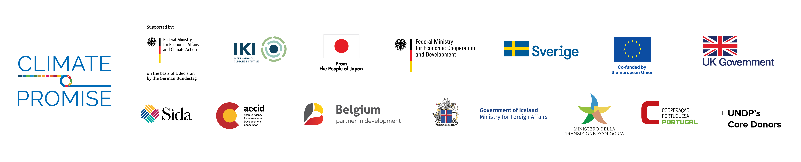

```{r setup, include=FALSE}
knitr::opts_chunk$set(echo = FALSE)

library(ggplot2)
library(tidyverse)
library(viridis)
library(collapsibleTree)
library(treemapify)
library(fmsb)

```

```{r panelset, echo=FALSE}
xaringanExtra::use_panelset()
```

```{r data, include=FALSE}

CoM_en <- readr::read_csv("/Users/macbook/Documents/research project/fol_2022/ndcTracker/RNDCTracker/Data/CoM_en.csv", show_col_types = FALSE)

CoM_EU_GE_inventory <- readr::read_csv("/Users/macbook/Documents/research project/fol_2022/ndcTracker/RNDCTracker/Data/CoM_EU_GE_inventory.csv", show_col_types = FALSE)


```


**Disclaimer **

*The views expressed in this publication are those of the author(s) and do not necessarily represent those of the United Nations, including UNDP, the NDC Partnership, the governments of Germany, Japan, the European Union, United Kingdom, Sweden, Spain, Belgium, Iceland, Italy, Portugal or other UNDP’s core contributors.*


**Acknowledgement**  


**Funding**


*This publication was developed under UNDP’s Climate Promise as part of the NDC Support Programme, in contribution to the NDC Partnership, with generous funding from the governments of Germany, Japan, the European Union, United Kingdom, Sweden, Spain, Belgium, Iceland, Italy, Portugal and other UNDP’s core contributors.*





## Chapter 1. Covenant of Mayors -  new voice for municipalities


Climate change is a prime concern for today’s world. There are several principal global frameworks and agreements (the [Sustainable Development Goals](https://www.un.org/en/climatechange/17-goals-to-transform-our-world), the [UN Framework Convention on Climate Change](https://unfccc.int/process-and-meetings/the-convention/what-is-the-united-nations-framework-convention-on-climate-change); the [Paris Agreement](https://www.un.org/en/climatechange/paris-agreement)) to guide actions and progress made by its member states. European Union (EU) has long been a global leader in the fight against climate change and has set a goal of becoming the world's first carbon-neutral continent by 2050 [@Melica2022]. The European Commission (EC) has committed to reducing CO2 emissions by at least 55% by 2030 compared to 1990. EU recognizes the critical role of local governments in this process and for this reason, the EC launched the Covenant of Mayors (CoM) in 2008, intending to reduce GHG emissions in participating cities and implement a Sustainable Energy Action Plan (SEAP) based on an initial emissions evaluation (Baseline Emission Inventory - BEI) on the city's territory [@Melica2021]. By December 2022, 12629 cities and local governments signed the CoM on MyCovenant, representing 1,081 billion people committed to combating climate change in Europe and beyond [@globalcovenantofmayors]. Since its foundation, the CoM initiative has been following EU climate policy [@Palermo2022] and has served a crucial role in raising awareness of climate change among local governments and in assisting cities committed to attaining CO2 reduction objectives. Remarkably, the CoM intends to minimize energy-related emissions and has extended scope and geographical coverage to include towns and local governments throughout the EU [@Melica2021].

In the meantime, in 2011, the CoM effort in the Eastern Neighboring Countries (CoM EAST) was established. CoM EAST signatories who joined before October 2016 (2020 Target) committed to lowering CO2 emissions by 20% by 2020 and developing SEAP. Recent signatories agreed to reduce CO2 by 30% by 2030 and report to SECAP [@Palermo2022]. Furthermore, Mayors Adapt - an effort concentrating on climate adaptation in cities, was established by the European Commission in 2014. Based on the experiences of the two initiatives, the CoM and Mayors Adapt merged in 2015, (Chatelet Raphael, 2018)establishing a new target of 40% GHG emission reduction by 2030 and integrating the adaptation pillars; it also introduced the Sustainable Energy and Climate Action Plan (SECAP), which was based on the BEI and a Risk and Vulnerability Assessment (RVA) for the adaptation part [@bib02]. The action plan (SECAP) is the primary document that outlines how a Covenant signatory will achieve its vision and goals. The CoM for Climate and Energy joined the Worldwide Covenant of Mayors (GCoM), the most significant global partnership for local climate leadership, in 2017 [@Rivas2018].

In this respect, a growing impetus is building to position cities and local governments as key drivers of climate action. On the one hand, budgetary restrictions, significant population transformations, and technological innovation on the other hand are reshaping the fabric of cities, raising concerns and increasing pressure on municipalities to make better and faster decisions. Implementing comprehensive climate policy to achieve substantial emissions reductions necessitates cities having the relevant tools and information to meet this task[@Rivas2018].

Georgia is deemed highly vulnerable to the consequences of climate change. The most recent report from the Intergovernmental Panel on Climate Change (IPCC) presents a grim view of the climate crisis that has been driven on by ongoing anthropogenic warming (IPCC Sixth Assessment Report, 2021). Interestingly, two industries with the highest GHG emission shares are energy and agriculture. In this respect, Georgia is a member of the CoM East alliance and has 26 signatory municipalities, whose status varies depending on the year of their incorporation. Prior to 2016, 12 Georgian cities joined the CoM initiative, with 14 more joining after 2016 (goal 2030). Currently, 10 CoM signatories have developed their action plans (SEAP), but none have been submitted within the timeline stipulated [@Palermo2022].

As the CoM program aims to connect cities and local governments to high-impact resources, such as user-friendly platforms that break down barriers to collecting, planning, implementing, and monitoring climate-related data, cities in Georgia have commenced defining GHG emission reduction targets and adaptation goals, as well as strategies to address climate risks and vulnerabilities. Moreover, as a member of the CoM, various international initiatives allow to raise awareness of climate change among local Georgian governments and provide methodologies and varied international approaches to developing local climate and energy plans.  The process is transparent at the municipal, EU, and global levels. Furthermore, local and public engagement are critical components of the CoM concept. As a member state of the CoM East alliance, Georgia must make climate and energy decisions that involve local governments, stakeholders, and residents. Additional international networks and financing enable climate-based policy and sustainable activities (for instance, projects related to renewable energy installations, building energy renovation, sustainable mobility and climate adaptation tools, providing sustainable infrastructure, etc.).

The latest research project in Georgia, titled "Tracing the connection between Climate Justice Action and the NDCs," highlighted the necessity of the involvement of municipalities in achieving NDCs and putting environmental measures into action. In particular, the study's findings showed that one of the most critical obstacles to recognizing the potential for mitigation on the part of sub-national actors is the lack of data that has been disaggregated at the local level. The capacity to monitor local climate measures' impact is also impacted as a result of this. Insufficient information is another factor that makes it challenging to develop efficient adaptation strategies [@bib14].

Given this, the research project aims to strengthen the evidence-based monitoring of municipal responsibilities within the context of CoM. To achieve this, the project is planned around the following primary objectives: 

1.	To study the existing practices and approaches of municipalities in the implementation of climate-related measures; 

2.	To identify the type of information/data the municipalities use for conducting/monitoring their climate actions and how they use the information/data;

3.	To determine who is responsible for the implementation and monitoring of climate issues on municipal levels (e.g. climate department at the municipality); 

In view of all stated above, in the below-presented chapters, we attempt to analyze how the commitments under the CoM are implemented on municipal levels. Moreover, how the signatory municipalities use the data/information for climate actions. Furthermore, the issue of current practices of municipalities in developing climate-related initiatives will be discussed. In the sense that data/information accessibility and availability has local-action consequences, on the other hand, it will be highlighted and further explored in the study. 


## Chapter 2. Research, analysis and tools

### Research Design

A literature review (LR) was undertaken on existing research materials to obtain in-depth information on the research issue. The LR was followed by collecting quantitative and qualitative empirical data using mixed methods study design and case study research approach. In particular, the research employs online survey and in-depth interviews methods with signatory municipality representatives to gather detailed information on the research subjects while considering diverse opinions. An online survey served as a baseline for the presented empirical research. Based on the survey findings, the pilot case study municipalities were selected and further studied through qualitative research, namely the in-depth interview method. MAXQDA, a computer-assisted qualitative data analysis software (CAQDAS), was used to analyze the obtained information.


** 1st Stage: Quantitative Research 

| Methods      | Target group | Quantity | 
| :---------  | :----------- |  :----------- |  
| Online     | Signatory municipalities of Covenant of Mayors | 26 | 

** 2nd Stage: Qualitative Research 

| Methods      | Target group | Quantity | 
| :---------  | :----------- |  :----------- |  
| In-depth interviews     | Signatory local government representative from case study municipalities | 10 | 

### Informant sampling and data collection

In the first stage, an online survey was conducted for studying the various practices by the local governments in combating climate change. In order to obtain in-depth information on the research objectives based on the survey outcomes, three municipalities were selected for case  studies. Accordingly, the informants were representatives associated with the local municipality, with whom in-depth interviews were conducted. It enabled the acquisition of multilateral information on the research topics. 


### Literature review 

An LR was used to analyze the research-associated documents and studies. Based on the LR, the online survey was based on the project Compete4SECAP funded by the European Commission. The main objective of the questionnaire is to evaluate and assess the impediments and drivers for implementation of SEAP and SECAPs with a special focus on the public sector. It aims at generating additional information on favorable and hindering conditions of SEAP and SECAP implementation. The survey focused on the following topics:

1.	Implementation of SEAP/SECAP;
2.	Networks and Participation;
3.	Experience concerning Energy Management Systems;
4.	Experience concerning Energy Competitions.

Empirical information was obtained by integrating two different methods: in-depth interviews, and an online survey. Accordingly, two types of research instruments were used for data collection: in-depth interview guidelines, and a structured questionnaire for the survey. 

### Online survey

In the second phase, a questionnaire for an online survey was developed. The survey used a 5-point scale and multiple-choice questions to allow municipality representatives to reply on the following key issues:

- SEAP/SECAP implementation administration and interagency cooperation; 
- Availability of data required for implementation of SEAP/SECAP;
- Risk and Vulnerability Assessment (RVA); 
- Challenges and needs in data/information availability; 
- Achievements of the Municipality Hall in implementing CoM commitments. 

The questionnaire was distributed to the all CoM signatory municipalities to incorporate the most diverse stakeholder groups into the study. The structured information obtained via this technique supported the data obtained through a qualitative component and ensured comprehensive coverage of the study objectives.
Because the survey facilitated the participation of multiple signatory municipalities, relatively extensive information was gathered, allowing the acquisition of multilateral information on the study themes. All 26 municipalities completed the survey in total.

### In-depth interviews

As previously stated, the last, third part of the study envisaged an in-depth interview approach that included ten conversations with the selected municipality representatives. The interviews resulted in an unfettered and open discussion with the interview partners. Remarkably, the interactions revealed detailed information and extensive disputes from stakeholders on study issues. The average length of each interview was around an hour.
A discussion plan was established specifically for each interview and contained broad subjects related to the interview partner's expertise, generally, concerning the issues of the existing practices and approaches in the implementation of climate-related measures, data availability for SE(C)APs for conducting/monitoring their climate actions and how they use the information/data, cooperation for the implementation and monitoring of climate issues, etc. 
The interviews were audio-recorded to avoid bias in the research process. Following that, the information obtained was transcribed/redacted. To fulfill the high standards of research ethics and transcribing method, the following principles were covered: To verify transcript against data recording and anonymization [@Kuckartz2014], and transcribe only as much and exactly as the research questions require.


### Qualitative and quantitative data analysis

The survey data was processed and further analyzed/visualized with the R/Rstudio package ggplot2, using descriptive statistics measures of central tendency and variability. All related data and visualizations are available as open source on GitHub.
Qualitative information collected through in-depth interviews was analyzed based on qualitative content analysis using Computer Assisted Qualitative Data Analysis (CAQDA) Software, MAXQDA. Using MAXQDA to analyze acquired data according to international standards provides several benefits. Depending on the interview segments, codes and sub-codes were developed, resulting in their merging and generalization at the later analysis stage to analyze the scale of each thematic category and intersections between categories and interview partners. 


### Ethical considerations of the research 

Each phase of the research, such as collection, storage, analysis and dissemination of information will be implemented in compliance with the ethical standards, which are based on the law of Georgia on Personal Data Protection, law of Georgia on Official Statistics and the Georgian Association for Public Opinion and Market Research’ Code of Ethics.
In order to protect the ethical principles, issues of confidentiality were discussed with respondents at the outset of the interviews for obtaining informed consent, which will outline what participation means in practice, how long/where it takes place and what participation involves. Likewise, there were mentioned benefits for participants, how privacy and confidentiality would be maintained, the inclusion and exclusion criteria for the study, any risks, inconvenience or discomfort that could reasonably be expected to result from the study.


## Chapter 3. Covenant of Mayors in Georgia: Research findings


### Overall considerations
This report is based on data collected through an online survey and qualitative interviews during November 2022. The initiative counts 26 committed cities and local authorities, covering a total population of 2,297,635 million inhabitants. Overall, the assessment shows that the Covenant of Mayors initiative is actively expanding throughout Georgia, with many new municipalities, including small towns, signing. Despite the ongoing interest and active participation, only ten of the 26 signatory cities were capable of submitting an action plan (SEAP). Throughout the research process, it was discovered that there is a high degree of responsibility and desire to participate in climate-related activities but a relatively low level of implementation at the local level. According to the data gathered, SEAP/SECAP implementation is highly dependent on a diverse set of resources (for example, human capital and data/information availability), the acquisition of which is a significant challenge for municipalities.
Since the survey could only be filled by representatives of municipalities and local governments coordinating and executing SEAP and SECAP, the results give a (non-representative) but valuable insight into the situation, challenges, and constraints of SEAP/SECAP implementation and CoM commitments in general.

### Main findings
As all signatory municipalities participated in the online survey, the results are based on the experience and opinions of the 26 municipalities participating in the initiative. The online questionnaire was filled out by 16 women and 10 men as persons responsible for the Covenant of Mayors on behalf of the municipality. On the other hand, 10 in-depth interviews were conducted with representatives of local-self-government, and local action group (LAG) in four selected municipalities (Chokhatauri, Batumi, Dedoplistskaro and Lagodekhi). 


### 3.1 Administration of SEAP/SECAP implementation and inter-agency cooperation 

**Interdepartmental cooperation for CoM commitments**

The decision-making body is an essential focus for the CoM effort; hence signatories are required/recommended to form a decision-making body to ensure the successful design, implementation, and monitoring of a SEAP/SECAP. It establishes a platform for multilevel climate and energy dialogues, including local governments, citizens, and other stakeholders. Local governments must include authorized SEAPs/SECAPs in relevant national and regional plans (e.g. NDC). An adequate governance structure is critical to a successful implementation in this environment. Local governments should improve communication across departments, including at the national level, and commence networking with other CoM signatories to share experiences. The study included a comprehensive review of municipal authorities responsible for carrying out and monitoring the CoM commitments. According to the findings, only Gurjaani and Dedoplistskaro municipalities indicate that a particular working group (composed of personnel from several departments) was formed by the mayor's order. The remaining cities identified individual departments, indicating that all signatory municipalities practice multi-departmental and cross-sector cooperation. Infrastructure, economic politics, finance, tourism, international relations, agriculture, transport, and municipal services are among the centrally accountable departments. Notably, in the case of Akhmeta municipality, Tusheti Protected Landscape Administration is responsible for creating SEAP/SECAP. According to the narratives, coordinating with other departments is a challenging and time-consuming process.
All of this has a significant impact on data collection and analysis. Especially in the context of power dynamics and bureaucracy, respondents indicate that departments have a lower impact on the decision-making process, as they need approval from higher authorities at every level of data collection and analysis. Moreover, there are many interruptions within collecting data, which require several departmental cooperation, and there are no rapid mechanisms available for cross-sharing essential data by sectors.


**Human capital and their expertise in CoM**

According to the study, human resources and their competence in climate and energy efficiency issues are equally challenging. The survey questionnaire was filled out by the municipality's person in charge of coordinating activities to carry out CoM responsibilities. In some cases, the in-depth interviews revealed that the assigned representatives to CoM find it challenging to even familiarize themselves with climate change and energy topics. The primary reason for this is that mostly CoM coordination is combined with other full-time jobs in different municipality departments that do not often directly relate to CoM issues or climate. Despite the fact that formal education matters for understanding and leading the CoM activities, only five respondents have formal high education in environmental science education. Other prevalence of education were management and administration (5), Engineering (4), economics (3) and law (3)(see fig.1).


<h5 class="small">*Source: The results of the survey implemented for and within the scope of the exploratory study objectives.* | *Note: own illustration, codecloud for the project*</h5>

<font size="2"> 
*Source: The results of the survey implemented for and within the scope of the exploratory study objectives.* | *Note: own illustration, codecloud for the project*
</font>

One of the significant challenges in the study process was highlighted as the competency of those participating in the SEAP/SECAP elaboration process. Interestingly, almost all signatory cities specify the need for technical knowledge and training in various fields, such as (i) project management (for effective collaboration with other departments); (ii) technical competencies (energy efficiency, energy management, renewable energies); (iii) data management (to develop a general methodology for screening outlier energy-activity observations), and (iv) the use of statistical methods for emissions estimation and forecasting) (access to financial instruments or funding possibilities). One respondent even stated that the SEAP elaboration process was halted years ago owing to a knowledge deficit.

>Occasionally we have such a request, the meaning of which word is unclear; there is no designated department or representative for it. We had a situation when we wanted to discover energy information, and even "Energo Pro" didn't know the meaning of that word, and we required a hotline for that; we called many places for that." (Chokhatauri municipality)

Almost all municipalities express a need for an energy efficiency specialist. For example, a representative from the Dedoplistskaro municipality remarks that the region has enormous potential in terms of energy efficiency. However, no human, technical, or financial resources are available to undertake research.

>There is a scarcity of knowledge, skilled staff, and technical equipment. Energy is a highly specific sector that necessitates a very reasonable approach. There should be specialized personnel working on this." (Chokhatauri municipality)

Furthermore, the person in charge of the municipality of Bolnisi stated that they required external assistance owing to a lack of expertise and experience in the waste sector.

**Engagement of citizens and other stakeholders in CoM implementation**

In general, the SEAP/SECAP should outline how citizens and stakeholders are involved in preparing committed documents. Citizens' and stakeholders' involvement should enhance decision-making body levels of planning, implementation, and monitoring.

The study uncovered many ways, such as public hearings, other consultation and partnership instruments, and the usage of websites/social networks to spread information about SEAP/SECAP, which Georgian municipalities utilize to encourage citizen engagement. For example, the municipality of Dedoplistskaro stated that civil groups' involvement was limited before Local Action Groups (LAG) were founded in the city. However, LAGs are now actively participating in the governmental decision-making process. Furthermore, the primary demand from residents in Lagodekhi municipality, which local officials met, was the rehabilitation and reinforcement of old river bridges. Public hearings with citizens and stakeholders concerning hydroelectric power stations and protected areas in Chokhatauri municipality are conducted.  Last but not least, Batumi city hall officials state that they want to release the entire SECAP document to the city hall website to receive and consider feedback from citizens and other stakeholders before officially submitting it.

In implementing CoM commitments, the study has identified various ways the signatory municipalities are supported by international (donor) organizations, NGOs, the private sector and other stakeholders. Particularly notable are the following interactions: 

(i) The main governance body mentioned by the respondents collaborating with signatory cities was the Ministry of environmental protection and agriculture of Georgia, which created an electronic portal with the Regional Environmental Center for the Caucasus (REC Caucasus). The Electronic system provides the implementations of fulfilling the commitments undertaken by the covenant of mayors' signatory municipalities by generating the SECAP and monitoring reports. 
(ii) International institutions and NGOs contribute to the knowledge transfer by training the municipality personnel. Moreover, data about the consumed energy was collected and processed employing a special form, which the REC Caucasus provided to the municipalities.


>In the case of Batumi, it turned out to be a good thing that each service and municipal organization collected and processed information about the consumed energy, so it was very easy for me in the case of Batumi. We had a special form, an Excel file, also provided by "REC Caucasus"


On the other hand, collaboration with local NGOs and International organizations like the UNDP, EBRD, and Polish Solidarity fund provides financial support for climate action project implementation, which also involves expert engagement, financing resources for each step of SEAP/SECAP elaboration, climate action project implementation, material resources (for instance waste pressing machines); 
(III) Signatory municipalities indicate an active partnership with the private sector, especially with tourism and agro-sector representatives. Regarding data generation, SOCAR petroleum was named as one of the primary data sources. Followed by local gas stations, wood processing enterprises, Energo Pro, and other potential investors who want to install solar panels in municipalities territories are main collaborators in the SEAP/SECAP elaborating process, as well. 

### 3.2 Availability of data required for SEAP/SECAP implementation 

As the study revealed, the following are the primary statistical or second information databases used by signatory municipalities: the National Statistics Office of Georgia (GeoStat); the National Agency of Public Registry (NAPR); reports and statistical information generated by local and international NGOs; databases of local energy agencies, suppliers, and utilities (for example, Joint-stock company Telasi bases, Energo Pro Georgia); local and international weather forecasts; private/public transportation companies; construction sector.


**Availability of data required for SEAP/SECAP implementation**

The Covenant of Mayors makes a CO2 and/or GHG inventory mandatory. The reason for this is apparent: An inventory is needed to assess the attainment of targets. It identifies the main emitting sectors and prioritizes areas for action. According to the results, the survey participants consider the CO2 and GHG inventory primarily significant to design and to implement climate policies; The respondents evaluated the importance of inventory on a 5-Point Likert Scale from 1 (not important) to 5 (very important), the average assessment was very high - 4.2, 20 municipalities assessed as "important" or "very important" in comparison with only one city considered inventory "not important". However, half of the municipalities (13 participant cities) have never implemented it (see fig. 2).


```{r , echo = FALSE, message = FALSE, warning=FALSE, fig.height = 7, fig.width = 7, dev.args=list(bg='transparent', pointsize=10), fig.cap='NDC sectors where the local self-government role should be enhanced'}


CoM_en_inventory <- CoM_en  %>%
       select(QU11) %>%
      count(QU11)

# Compute percentages
CoM_en_inventory$fraction <- CoM_en_inventory$n / sum(CoM_en_inventory$n)

# Compute the cumulative percentages (top of each rectangle)
CoM_en_inventory$ymax <- cumsum(CoM_en_inventory$fraction)

# Compute the bottom of each rectangle
CoM_en_inventory$ymin <- c(0, head(CoM_en_inventory$ymax, n=-1))

# Compute label position
CoM_en_inventory$labelPosition <- (CoM_en_inventory$ymax + CoM_en_inventory$ymin) / 2

# Compute a good label
CoM_en_inventory$label <- paste0(CoM_en_inventory$QU11, "\n Value: ", CoM_en_inventory$n, " (", round(CoM_en_inventory$fraction *100,1), "%)")

# Make the plot
CoM_Figure2_EN <- ggplot(CoM_en_inventory, aes(ymax=ymax, ymin=ymin, xmax=4, xmin=3, fill=QU11)) +
  geom_rect() +
  geom_text( x=1, aes(y=labelPosition, label=label, color=QU11), size=6) + # x here controls label position (inner / outer)
 scale_fill_manual(values=c("#A21942","#26BDE2", "#4C9F38")) +
  scale_color_manual(values=c("#A21942", "#26BDE2", "#4C9F38")) +
  coord_polar(theta="y") +
  xlim(c(-1, 4)) +
  theme_void() +
  theme(legend.position = "none")

CoM_Figure2_EN

ggsave("Visualisation/CoM_Figure2_EN.png", 
       CoM_Figure2_EN,
       width =35, 
       height = 20, 
       units = "cm", 
       dpi = 400)


```


<font size="2"> 
*Source: The results of the survey implemented for and within the scope of the exploratory study objectives.* | *Note: own illustration for the project, author Temur Gugushvili*
</font>

Based on the interviewed municipality representatives, the grounds for this include various reasons. Mostly, a lack of understanding of the significance and necessity of inventory, a lack of expertise in conducting it, and a shortage of resources (for example, the availability of a unified database).

>None of the municipalities has an appropriate system that would allow them to inventory emissions with their own resources. However, it is very important, that an electronic system has been created, on the basis of which the municipalities themselves can work in the system, and subsequently, the "SECAP" reports will be prepared (Batumi municipality)

According to the research prepared as part of the COMPETE4SECAP project, only three countries have cities that do not undertake CO2 or GHG inventories. The authors remarked that this could not be true. Since few municipalities have GHG inventories conducted by external consultants available on the CoM Website, some responders may have misunderstood the question. That might be true for certain Georgian cities as well. In reality, unlike the European cities surveyed in 2018, none of the municipalities in Georgia stated that they conduct GHG inventories regularly. Overall, no city has been able to put into practice regular inventory implementation over the years (see fig. 3).


```{r , echo = FALSE, message = FALSE, warning=FALSE, fig.height = 7, fig.width = 7, dev.args=list(bg='transparent', pointsize=10), fig.cap = "Number (percentage) of municipalities compile a CO2 or GHG-inventory"}


CoM_Figure2_EN_Compare <- ggplot(CoM_EU_GE_inventory, aes(reorder(Country, +Number), Percent, fill=Category,)) + 
  geom_col(position="fill") +
  theme_minimal()+
  scale_fill_manual(values=c("#DD1367", "#26BDE2", "#00689D")) +
  scale_y_continuous(breaks=seq(0, 1, 0.2), labels = scales::percent)+
  labs(x = "", 
       y = "",
       fill = "CO2 or GHG-inventory")
  

ggsave("Visualisation/CoM_Figure2_EN_Compare.png", 
       CoM_Figure2_EN_Compare,
       width =25, 
       height = 13, 
       units = "cm", 
       dpi = 400)

CoM_Figure2_EN_Compare

```

<font size="2"> 
*Source: The results (Georgia) of the survey implemented for and within the scope of the exploratory study objectives. Note: chart by Temur Gugushvili, adapted from Ralf Schüle, Jan Kaselofsky, Calvin Lai Ming Tsun (2018): Report “Evaluation the implementation of SEAP and SECAPs”, p. 14* 
</font>


**SEAP/SECAP projects and data collection practices by sector**

With the BEI results in hand, the local government may identify the highest emitting sectors in their region. Prior to that, municipalities need to collect information/data and then quantify the effort required to reach the minimum target set by the initiative. Figure 3 depicts the distribution of deployed SEAP/SECAP projects and data-gathering practices sector by sector to make climate-based and energy-efficient decisions. Waste management, transportation, street lighting, forestry, energy generation and transport, buildings, and agriculture appear to be the frequently selected sectors for planning and executing climate-based initiatives. 
The survey identified buildings and transportation based on 21 and 18 municipality responses as the top two sectors in which self-governments are making data-driven climate decisions. In contrast, data-driven climate-smart, energy-efficient actions and projects in the agriculture, outdoor lighting, and forestry sectors were assessed rather weakly.

```{r , echo = FALSE, message = FALSE, warning=FALSE, fig.height = 6, fig.width = 9, dev.args=list(bg='transparent', pointsize=10), fig.cap= "SEAP/SECAP projects and data collection practices by sector"}


CoM_en_project <- CoM_en  %>%
       select(QU4, QU13_1, QU13_2, QU13_3, QU13_4) %>%
       pivot_longer(!QU4, names_to = "QU_ALL", values_to = "NDC_GE") %>%
       drop_na() %>%
       mutate(NDC_EN  = recode(NDC_GE, 
                              "შენობები" = "Buildings",
                              "ტრანსპორტი" = "Transport",
                              "სოფლის მეურნეობა" = "Agriculture",
                              "9არ ჩაგვიტარებია" = "9No projects/data",
                              "გარე განათება" = "Outside Light",
                              "ენერგიის გენერაციისა და გადაცემის სექტორი" = "Energy generation and transmission",
                              "Ნარჩენების მართვა" = "Waste management")) %>%

  
  
select(NDC_EN) %>%
count(NDC_EN) %>%
  mutate(TTable = "Project implemented")


CoM_en_data <- CoM_en  %>%
       select(QU4, QU14_1, QU14_2, QU14_3, QU14_4) %>%
       pivot_longer(!QU4, names_to = "QU_ALL", values_to = "NDC_GE") %>%
       drop_na() %>%
       mutate(NDC_EN  = recode(NDC_GE, 
                              "შენობები" = "Buildings",
                              "ტრანსპორტი" = "Transport",
                              "სოფლის მეურნეობა" = "Agriculture",
                              "არ გამოგვიყენებია" = "9No projects/data",
                              "გარე განათება" = "Outside Light",
                              "Სატყეო სექტორი" = "Forestry",
                              "ენერგიის გენერაციისა და გადაცემის სექტორი" = "Energy generation and transmission",
                              "Ნარჩენების მართვა" = "Waste management")) %>%

  
  
select(NDC_EN) %>%
count(NDC_EN) %>%
  mutate(TTable = "Evidence-based")

CoM_en_project_data <- bind_rows(CoM_en_project, CoM_en_data)


CoM_Figure5_EN <- ggplot(CoM_en_project_data, aes(NDC_EN, n, group = TTable, fill = TTable)) +
  geom_col(position = "dodge")+
  theme_minimal()+
  coord_flip()+
  scale_fill_manual(values = c("#A21942", "#26BDE2"))+
  scale_y_continuous(breaks=seq(0, 26, 2), limits = c(0,26))+
  scale_x_discrete(labels = c("No projects/data", "Agriculture", "Buildings", 
                              "Energy generation and transmission", "Forestry",
                              "Outside Light", "Transport",
                              "Waste management"))+
  labs(x = "", 
       y = "Number of municipalities",
       fill = "SEAP/SECAP Projects")


  ggsave("Visualisation/CoM_Figure5_EN.png", 
       CoM_Figure5_EN,
       width =20, 
       height = 10, 
       units = "cm", 
       dpi = 400)

  
  
CoM_Figure5_EN


```

<font size="2"> 
*Source: The results of the survey implemented for and within the scope of the exploratory study objectives.* | *Note: own illustration for the project, author Temur Gugushvili*
</font> 


**Data quality in four sectors**


Survey shows that not all municipalities have the same privilege to access high-quality data. Based on the self-assessment on the five-point Likert scale (1- lowest point, 5- highest point according to the category), 26 signatory municipalities determine the position (see fig 5, black points) in terms of data reliability, quality, availability, and relevance in the following sectors: waste management, transport, street light and buildings.


```{r , echo = FALSE, message = FALSE, warning=FALSE, fig.height = 6, fig.width = 9, dev.args=list(bg='transparent', pointsize=10), fig.cap= "Municipalities assessment on data quality, availability, reliability and format in different sectors"}

CoM_data_quality1_EN <- CoM_en  %>%
  select(QU2, QU23, QU24, QU25, QU26) %>%
  pivot_longer(!QU2, names_to = "QU_ALL", values_to = "Assessment") %>%
  drop_na() %>%
  mutate(Assessment_ge = recode(QU_ALL, 
                                "QU23" = "Availability",
                                "QU24" = "Quality",
                                "QU25" = "Data formats",
                                "QU26" = "Reliability")) %>%
  
  select(QU2, Assessment_ge, Assessment)  %>%
  group_by(QU2, Assessment_ge) %>%
  summarise(Avarage =  round(mean(Assessment),1)) %>%
  mutate(Criterion = "Buildings")


CoM_data_quality2_EN <- CoM_en  %>%
  select(QU2, QU32, QU33, QU34, QU35) %>%
  pivot_longer(!QU2, names_to = "QU_ALL", values_to = "Assessment") %>%
  drop_na() %>%
  mutate(Assessment_ge = recode(QU_ALL, 
                                "QU32" = "Availability",
                                "QU33" = "Quality",
                                "QU34" = "Data formats",
                                "QU35" = "Reliability")) %>%
  
  select(QU2, Assessment_ge, Assessment)  %>%
  group_by(QU2, Assessment_ge) %>%
  summarise(Avarage =  round(mean(Assessment),1)) %>%
  mutate(Criterion = "Transport")


CoM_data_quality3_EN <- CoM_en  %>%
  select(QU2, QU38, QU39, QU40, QU41) %>%
  pivot_longer(!QU2, names_to = "QU_ALL", values_to = "Assessment") %>%
  drop_na() %>%
  mutate(Assessment_ge = recode(QU_ALL, 
                                "QU38" = "Availability",
                                "QU39" = "Quality",
                                "QU40" = "Data formats",
                                "QU41" = "Reliability")) %>%
  
  select(QU2, Assessment_ge, Assessment)  %>%
  group_by(QU2, Assessment_ge) %>%
  summarise(Avarage =  round(mean(Assessment),1)) %>%
  mutate(Criterion = "Street light")


CoM_data_quality4_EN <- CoM_en  %>%
  select(QU2, QU44, QU45, QU46, QU47) %>%
  pivot_longer(!QU2, names_to = "QU_ALL", values_to = "Assessment") %>%
  drop_na() %>%
  mutate(Assessment_ge = recode(QU_ALL, 
                                "QU44" = "Availability",
                                "QU45" = "Quality",
                                "QU46" = "Data formats",
                                "QU47" = "Reliability")) %>%
  
  select(QU2, Assessment_ge, Assessment)  %>%
  group_by(QU2, Assessment_ge) %>%
  summarise(Avarage =  round(mean(Assessment),1)) %>%
  mutate(Criterion = "Waste management")


CoM_data_quality <- bind_rows(CoM_data_quality1_EN, CoM_data_quality2_EN, CoM_data_quality3_EN, CoM_data_quality4_EN) 


CoM_Figure23_EN_distribution <- ggplot(CoM_data_quality, aes(Assessment_ge, Avarage, fill=Assessment_ge,
                              text = paste("Municiaplity: ", QU2,
                                            "<br>Avarage:", Avarage)
                                  )) + 
  geom_boxplot(width = 0.4, width.errorbar = 0.5, outlier.shape = NA, alpha=0.9)+
  geom_jitter(color="black", size=0.4, alpha=0.9) +
  theme_minimal(base_family="Sylfaen")+
  theme(legend.position = "none")+
  #stat_summary(fun=mean, geom="point", fill="red", color="red", shape=23, size=2)+
  scale_fill_manual(values=c("#A21942", "#DDA63A", "#00689D", "#56C02B"))+
  labs(x = "", 
       y = "5-Point Likert Scale",
       fill = "SEAP/SECAP პროექტები")+
  facet_wrap(vars(Criterion), nrow = 2, ncol = 2)

plotly::ggplotly(CoM_Figure23_EN_distribution, tooltip = "text")


```

<font size="2"> 
*Source: The results of the survey implemented for and within the scope of the exploratory study objectives.* | *Note: own illustration for the project, author Temur Gugushvili*
</font> 

Figure 6, based on the average assessments, illustrates that the CoM signatory municipalities rated street lighting with the highest score in all four categories compared to the other three sectors, such as transport, waste management and buildings. Based on the responses, municipal officials rate data reliability, quality, and availability in the waste management and building sectors as very acceptable. However, the transportation sector receives the lowest rating across all four data types.

```{r , echo = FALSE, message = FALSE, warning=FALSE, fig.height = 6, fig.width = 9, dev.args=list(bg='transparent', pointsize=10), fig.cap="Average assessments of data reliability, quality, availability, and formats in different sectors"}


CoM_data_assessment1_EN <- CoM_en  %>%
  select(QU4, QU23, QU24, QU25, QU26) %>%
  pivot_longer(!QU4, names_to = "QU_ALL", values_to = "Assessment") %>%
  drop_na() %>%
  mutate(Assessment_ge = recode(QU_ALL, 
                                 "QU23" = "Availability",
                                 "QU24" = "Quality",
                                 "QU25" = "Data formats",
                                 "QU26" = "Reliability")) %>%
  
  select(Assessment_ge, Assessment)  %>%
  group_by(Assessment_ge) %>%
  summarise(Avarage =  round(mean(Assessment),1)) %>%
  mutate(Criterion = "Buildings")


CoM_data_assessment2_EN <- CoM_en  %>%
       select(QU4, QU32, QU33, QU34, QU35) %>%
       pivot_longer(!QU4, names_to = "QU_ALL", values_to = "Assessment") %>%
       drop_na() %>%
  mutate(Assessment_ge = recode(QU_ALL, 
                                 "QU32" = "Availability",
                                 "QU33" = "Quality",
                                 "QU34" = "Data formats",
                                 "QU35" = "Reliability")) %>%
  
  select(Assessment_ge, Assessment)  %>%
  group_by(Assessment_ge) %>%
  summarise(Avarage =  round(mean(Assessment),1)) %>%
       mutate(Criterion = "Transport")


CoM_data_assessment3_EN <- CoM_en  %>%
       select(QU4, QU38, QU39, QU40, QU41) %>%
       pivot_longer(!QU4, names_to = "QU_ALL", values_to = "Assessment") %>%
       drop_na() %>%
  mutate(Assessment_ge = recode(QU_ALL, 
                                 "QU38" = "Availability",
                                 "QU39" = "Quality",
                                 "QU40" = "Data formats",
                                 "QU41" = "Reliability")) %>%
  
  select(Assessment_ge, Assessment)  %>%
  group_by(Assessment_ge) %>%
  summarise(Avarage =  round(mean(Assessment),1)) %>%
       mutate(Criterion = "Street light")


CoM_data_assessment4_EN <- CoM_en  %>%
       select(QU4, QU44, QU45, QU46, QU47) %>%
       pivot_longer(!QU4, names_to = "QU_ALL", values_to = "Assessment") %>%
       drop_na() %>%
  mutate(Assessment_ge = recode(QU_ALL, 
                                 "QU44" = "Availability",
                                 "QU45" = "Quality",
                                 "QU46" = "Data formats",
                                 "QU47" = "Reliability")) %>%
  
  select(Assessment_ge, Assessment)  %>%
  group_by(Assessment_ge) %>%
  summarise(Avarage =  round(mean(Assessment),1)) %>%
       mutate(Criterion = "Waste management")


CoM_Assessment_all_EN <- bind_rows(CoM_data_assessment1_EN, CoM_data_assessment2_EN, CoM_data_assessment3_EN, CoM_data_assessment4_EN)


CoM_Figure23_EN <- ggplot(CoM_Assessment_all_EN, aes(Criterion, Avarage, fill = Assessment_ge)) +
  geom_col(position = "dodge")+
  coord_flip()+
  theme_minimal(base_family="Sylfaen")+
  geom_text(aes(label = Avarage), size = 3, vjust = 0, nudge_y = 0.2)+
  theme(legend.position = "none")+
  scale_fill_manual(values = c("#A21942", "#DDA63A", "#00689D", "#56C02B"))+
  scale_y_continuous(breaks=seq(0, 5, 1), limits = c(0, 5))+
  labs(x = "", 
       y = "Mean",
       fill = "SEAP/SECAP პროექტები")+
  facet_wrap(vars(Assessment_ge), nrow = 2, ncol = 2)


  ggsave("Visualisation/CoM_Figure23_EN.png", 
       CoM_Figure23_EN,
       width =20, 
       height = 15, 
       units = "cm", 
       dpi = 400)


CoM_Figure23_EN

```

<font size="2", line-height: 1.6> 
*Source: The results of the survey implemented for and within the scope of the exploratory study objectives.* | *Note: own illustration for the project, author Temur Gugushvili*
</font> 

**Data availability for municipal buildings**

*Municipal buildings*

Municipal buildings, in general, comprise administrative, public service, and educational buildings. Figure 7 depicts the responses obtained about the availability and collection of energy data for municipal buildings. Data from the energy industry is one of the most important information sources for the CoM initiative's commitments.
According to the survey findings, the majority of the participating municipalities (16 cities) have gathered data in this sector, mainly at the administrative building level. Only a few cities collect data through aggregated data collecting, estimates, or other methods. In terms of data units, the largest number of municipalities (14 cities) calculate energy and consumption costs data. Most cities report that they do not gather energy data for other municipal public buildings.


```{r, echo = FALSE, message = FALSE, warning=FALSE, fig.height = 7, fig.width = 9, dev.args=list(bg='transparent', pointsize=10),fig.cap= "Energy data availability and collection for municipal buildings"}


CoM_Building_level_EN <- CoM_en  %>%
  select(QU15, QU16, QU17, QU18) %>%
  pivot_longer(QU15 : QU18, names_to = "QU_ALL", values_to = "Building_level") %>%
  drop_na() %>% 
  mutate(Level = recode(QU_ALL,
                        "QU15" = "Administration buildings",
                        "QU16" = "Public service buildings",
                        "QU17" = "Educational institutions",
                        "QU18" = "Other public buildings")) %>% 
  mutate(Number2 = recode(QU_ALL,
                        "QU15" = "4",
                        "QU16" = "3",
                        "QU17" = "2",
                        "QU18" = "1")) %>% 
  mutate(Number = recode(Building_level,
                         "2აგრეგირებული მონაცემების შეგროვება (მაგ. რამდენიმე შენობის გაერთიანება)" = "2",
                         "5არ გროვდება მონაცემები" = "5",
                         "1მონაცემების შეგროვება თითოეული ინდივიდუალური შენობისთვის" = "1",
                         "4მონაცემთა შეგროვების სხვა გზები" = "4",
                         "3შეფასებული / სავარაუდო / მოდელირებული მონაცემები (მაგ. ეროვნული კვლევების მიხედვით)" = "3")) %>% 
  mutate(Building_level_short = recode(Building_level,
                         "2აგრეგირებული მონაცემების შეგროვება (მაგ. რამდენიმე შენობის გაერთიანება)" = "Aggregated data collection",
                         "5არ გროვდება მონაცემები" = "No data collection",
                         "1მონაცემების შეგროვება თითოეული ინდივიდუალური შენობისთვის" = "Each individual building",
                         "4მონაცემთა შეგროვების სხვა გზები" = "Other ways",
                         "3შეფასებული / სავარაუდო / მოდელირებული მონაცემები (მაგ. ეროვნული კვლევების მიხედვით)" = "Assessed/estimated/modelled data")) %>% 

select(Level, Building_level_short, Number2, Number) %>%
  group_by(Level, Building_level_short, Number2, Number)  %>%
  summarise(Municipalities = as.numeric(n())) %>% 
  mutate(Question = "Energy data")

CoM_Building_level_EN <- transform(CoM_Building_level_EN, Number = as.numeric(Number)) 
CoM_Building_level_EN <- transform(CoM_Building_level_EN, Number2 = as.numeric(Number2)) 


CoM_Building_type_EN <- CoM_en  %>%
  select(QU19, QU20, QU21, QU22) %>%
  pivot_longer(QU19 : QU22, names_to = "QU_ALL", values_to = "Building_level") %>%
  drop_na() %>% 
  mutate(Level = recode(QU_ALL,
                        "QU19" = "Administration buildings",
                        "QU20" = "Public service buildings",
                        "QU21" = "Educational institutions",
                        "QU22" = "Other public buildings")) %>% 
  mutate(Number2 = recode(QU_ALL,
                        "QU19" = "4",
                        "QU20" = "3",
                        "QU21" = "2",
                        "QU22" = "1")) %>% 
  mutate(Building_level_short = recode(Building_level, 
                                       "1ორივე" = "Both",
                                       "2მონაცემები ენერგიის ხარჯების შესახებ" = "Data on energy costs",
                                       "3მონაცემები ენერგომოხმარების შესახებ" = "Data on energy consumption	",
                                       "5არ გროვდება მონაცემები" = "No data collection")) %>% 
  mutate(Number = recode(Building_level, 
                         "1ორივე" = "1",
                         "2მონაცემები ენერგიის ხარჯების შესახებ" = "2",
                         "3მონაცემები ენერგომოხმარების შესახებ" = "3",
                         "5არ გროვდება მონაცემები" = "4")) %>% 
  
  select(Level, Building_level_short, Number, Number2) %>%
  group_by(Level, Building_level_short, Number, Number2)  %>%
  summarise(Municipalities = as.numeric(n())) %>% 
  mutate(Question = "Data unit")


CoM_Building_type_EN <- transform(CoM_Building_type_EN, Number = as.numeric(Number)) 
CoM_Building_type_EN <- transform(CoM_Building_type_EN, Number2 = as.numeric(Number2)) 


CoM_Building_both_EN <- bind_rows(CoM_Building_level_EN, CoM_Building_type_EN)

CoM_Figure15_EN <- ggplot(CoM_Building_both_EN, aes(reorder(Building_level_short, +Number), reorder(Level, +Number2), fill=Municipalities,))+
  geom_tile() +
  geom_text(aes(label = Municipalities), size = 3,  color = "black", show.legend = FALSE)+
  theme_minimal(base_family="Sylfaen") +
  theme(axis.text.x=element_text(angle = 90, hjust=1, size=9, colour="black"),
        axis.text.y=element_text(angle = 0, hjust=1, size=9, colour="black"))+
  scale_fill_distiller(name = "Number of municipalities", direction = 1, palette = "Purples", limits=c(0, 26), breaks=seq(0, 26, 2))+
  labs(x = "",
       y = "") +
  facet_wrap(vars(Question), nrow = 2, ncol = 2, scales = "free_x")


CoM_Figure15_EN

```

*Source: The results of the survey implemented for and within the scope of the exploratory study objectives.* | *Note: own illustration for the project, author Temur Gugushvili*

**Data availability for Street lighting**

In line with the survey results, municipal-level data is most readily available in the street lighting sector. Figure 8 shows that all signatory municipalities gather data in at least one of the five key areas (categories listed in the figure below). Most cities (21 municipalities) have data on street lighting expenses over time. In addition, 17 cities provide statistics on the overall number of energy-efficient LED bulbs that have been changed. However, fewer cities offer specific information regarding the installed amount of bulbs/type of bulbs/power of each bulb compared to the data in other categories. Only 15 municipalities can process and utilize it for project planning if necessary.
It should be noted that a large part of the climate action projects carried out within the framework of COM is related to the replacement of street lights with energy-efficient bulbs. For example, Rustaveli city and Kvareli municipality indicate that 80% of street lights in the municipality have been replaced with LED bulbs.


```{r, echo = FALSE, message = FALSE, warning=FALSE, fig.height = 5, fig.width = 7, dev.args=list(bg='transparent', pointsize=10), fig.cap= "Data availability in the Street lighting sector"}

CoM_en_street_light_EN <- CoM_en  %>%
       select(QU4, QU37_1, QU37_2, QU37_3, QU37_4) %>%
       pivot_longer(!QU4, names_to = "QU_ALL", values_to = "Street_light") %>%
       drop_na()  %>%
       mutate(Street_light_EN  = recode(Street_light, 
                              "განათებული გზების (ქუჩების) სიგრძე" = "Length of lighted streets",
                              "გარე განათების ენერგიის მოხმარება" = "Street lighting electric energy consumption  (kWh)",
                              "გარე განათების სექტორის მიერ ენერგიის ხარჯი წლების მიხედვით" = "Expenses of the street lighting sector in years",
                              "გზებზე (ქუჩებზე) დამონტაჟებული სანათების რაოდენობა და მახასიათებლები" = "Installed number of bulbs/type of bulbs/power of each bulb",
                              "დამონტაჟებული LED ნათურების რაოდენობა" = "The total number of the replaced energy efficient LED lamps")) %>%

  
  
select(Street_light_EN) %>%
count(Street_light_EN)


CoM_Figure37_EN <- ggplot(CoM_en_street_light_EN, aes(Street_light_EN, n)) +
  geom_col(fill = "#DD1367")+
  geom_text(aes(label = n), size = 5, vjust = 0, nudge_y = 0.7)+
  coord_flip()+
  xlab("")+
  ylab("Number of municipalities")+ 
  theme_minimal()+
  scale_y_continuous(breaks=seq(0, 26, 2), limits = c(0,26)) 
    


  CoM_Figure37_EN
```

*Source: The results of the survey implemented for and within the scope of the exploratory study objectives. Note: own illustration for the project, author Temur Gugushvili*

**Data availability in the waste management sector**

Waste as among mandatory sectors for signatory municipalities has also been studied. According to the online survey, three signatory municipalities out of 26 do not gather information about waste management. However, other cities use different approaches to collecting waste data. For instance, Sighnaghi municipality uses an electronic map for systematic waste management. Bolnisi municipality works with other municipalities and NGOs to develop a sustainable waste management system and action plan for 2023. The person responsible for the Bolnisi municipality remarked that they needed external support due to a lack of knowledge and experience in the waste sector.
Gurjaani Municipality indicates that they are regularly gathering data for the waste sector. Tianeti Municipality highlighted the lack of waste equipment, which is key to implementing sustainable waste action projects.  
Tbilisi and Batumi municipalities have successful experience in terms of plastic waste collection. With the support of UNDP, a behavioral experiment was conducted in these two cities. According to this project, about 40 transparent bins were placed, which positively affected the sorting and processing of plastic bottles by citizens and local authorities. It is worth noting that other municipalities were also interested in the implemented project. Batumi City Hall had active communication with Lagodekhi and Samtredia local authorities.
Figure 10 depicts the sectors in which most municipalities gather data/information, namely municipal buildings (18 municipalities), waste and transport (17 municipalities), and energy (11 municipalities). In contrast, the fewest respondents mention using data for public safety, information and technological communications.

```{r , message = FALSE, warning=FALSE, fig.height = 6, fig.width = 9, dev.args=list(bg='transparent', pointsize=10), fig.cap="Data collected in the risk and vulnerability assessment process by sector"}

CoM_en_RVA_INFO_EN <- CoM_en  %>%
       select(QU4, QU50_1, QU50_2, QU50_3, QU50_4, QU50_5, QU50_6, QU50_7,
              QU50_8, QU50_9, QU50_10, QU50_11, QU50_12, QU50_13, QU50_14) %>%
       pivot_longer(!QU4, names_to = "QU_ALL", values_to = "RVA_INFO") %>%
       drop_na() %>% 
       select(RVA_INFO) %>%
       count(RVA_INFO) %>%
       mutate(RVA_INFO_EN  = recode(RVA_INFO, 
                                    "განათლება"	= "Education",
                                    "გარემო და ბიომრავალფეროვნება" =	"Environment & Biodiversity",
                                    "ენერგია" =	"Energy",
                                    "ინფორმაცია და ტექნოლოგიური კომუნიკაციები" =	"ICT", 
                                    "მიწათსარგებლობა" = "Land use planning",
                                    "ნარჩენები" = "Waste",
                                    "Საზოგადოებრივი უსაფრთხოება"	= "Civil protection & Emergency",
                                    "სოფლის მეურნეობა და ტყე" = "Agriculture & Forestry",
                                    "ტრანსპორტი" = 	"Transport",
                                    "ტურიზმი" = 	"Tourism",
                                    "შენობები" = 	"Buildings",
                                    "წყალი" = "Water",
                                    "ჯანმრთელობა" = "Health"))
                               


CoM_Figure50_EN <- ggplot(CoM_en_RVA_INFO_EN, aes(RVA_INFO_EN, n)) +
  geom_col(fill = "#26BDE2") +
  geom_text(aes(label = n), size = 3, vjust = 0, nudge_y = 0.2)+
  coord_flip() +
  scale_y_continuous(breaks=seq(0, 26, 2), limits = c(0,26)) +
  xlab("") +
  ylab("Number of municipalities") + 
  theme_minimal(base_family="Sylfaen")


CoM_Figure50_EN

```

*Source: The results of the survey implemented for and within the scope of the exploratory study objectives. Note: own illustration for the project, author Temur Gugushvili*

### 3.3 Climate Change Adaptation - Risk and Vulnerability Assessment (RVA)


**Access to data in developing risk and vulnerability assessments**

Local governments might use the climate risk and vulnerability assessment (RVA) to identify current climate risks and how they are anticipated to evolve in the future. The methodological framework for adaptation assesses current risk, vulnerability, and impact circumstances. Local governments must disclose information regarding the type of climate hazard and its consequences, as well as anticipated changes in hazard timeframe, frequency, intensity, vulnerable sectors and populations, and adaptation plans. As a result of this commitment, local governments must rely on a variety of databases and sources.
The responses obtained on the 5-point Likert scale in the below-illustrated diagram show that data on precipitation and heat, as well as drought and fires are among the most accessible. However, based on the survey results, data on storm and movement of rocks with 2.6 and 2.4 points is only available to a small extent in developing the risk and vulnerability assessment. 

```{r, echo = FALSE, message = FALSE, warning=FALSE, fig.height = 16, fig.width = 19, dev.args=list(bg='transparent', pointsize=10), fig.cap= "Access to data in developing risk and vulnerability assessments"}

CoM_en_RVAavailability <- CoM_en  %>%
       select(QU4, QU51, QU52, QU53, QU54, QU55, QU56, QU57, QU58) %>%
       pivot_longer(!QU4, names_to = "QU_ALL", values_to = "RVAavailability") %>%
       drop_na() %>%
       mutate(QU_ALL_TEXT  = recode(QU_ALL, 
                              QU51 = "Extreme heat (3.2)",
                              QU52 = "Extreme cold (3.2)",
                              QU53 = "Heavy precipitation (3.3)",
                              QU54 = "Floods (2.8)",
                              QU55 = "Drought (3.1)",
                              QU56 = "Storms, sea level rise (2.6)",
                              QU57 = "Fire (3.0)",
                              QU58 = "Landslide (mass movement) (2.4)")) %>%
       select(QU_ALL_TEXT, RVAavailability)  %>%
       group_by(QU_ALL_TEXT) %>%
       summarise(Avarage =  mean(RVAavailability))%>%
       mutate(id=seq(1,8))


label_data <- CoM_en_RVAavailability

number_of_bar <- nrow(label_data)
angle <-  90 - 360 * (label_data$id-0.5) /number_of_bar 
label_data$hjust<-ifelse( angle < -90, 1, 0)
label_data$angle<-ifelse(angle < -90, angle+180, angle)


CoM_Figure51_EN <- ggplot(CoM_en_RVAavailability, aes(x=as.factor(id), y=Avarage)) + 
  geom_bar(stat="identity", fill=alpha("#0A97D9", 0.7)) +
  ylim(-2, 5) +
  theme_minimal(base_family="Sylfaen") +
  theme(
    axis.text = element_blank(),
    axis.title = element_blank(),
    panel.grid = element_blank(),
    plot.margin = unit(rep(-1,4), "cm")) +
  coord_polar(start = 0) +
  geom_text(data=label_data, aes(x=id, y=Avarage+0.5, label=QU_ALL_TEXT, hjust=hjust), color="black", fontface="bold",alpha=0.6, size=6, angle= label_data$angle, inherit.aes = FALSE ) 
    
CoM_Figure51_EN

```

*Source: The results of the survey implemented for and within the scope of the exploratory study objectives. Note: own illustration for the project, author Temur Gugushvili*

According to survey results, 20 municipalities out of 26 reports rely on local knowledge to develop risk and vulnerability assessments. Furthermore, the databases of environmental organizations and daily or seasonal weather forecasts are among the most frequently used sources specified by 12 participant municipalities, followed by 11 responses on adopting national and local strategies for sustainable economic development. In comparison, the least used resources in this process were infrastructure maps, national or local water resource strategies, global or regional climate impact models/reports, and national health studies.

```{r fig.cap= "Sources which municipalities rely on while developing RVA", message = FALSE, warning=FALSE, fig.height = 6, fig.width = 9, dev.args=list(bg='transparent', pointsize=10)}

CoM_en_RVA_local_EN <- CoM_en  %>%
  select(QU49_1, QU49_2, QU49_3, QU49_4, QU49_5, QU49_6, QU49_7, QU49_8, QU49_9) %>%
  pivot_longer(QU49_1 : QU49_9, names_to = "QU_ALL", values_to = "Local") %>%
  drop_na() %>% 
  select(Local) %>%
  count(Local) %>% 
  mutate(Local_EN  = recode(Local, 
"ადგილობრივი ცოდნა" = "Local knowledge",
"ამინდის ექსტრემალური გამოვლინებები" = "Extreme events monitoring (heat waves, cyclones, storms, floods)",
"გარემოსდაცვითი ორგანიზაციები" =	"Environment organisations",
"გარემოსდაცვის Ეროვნული ან ადგილობრივი სტრატეგიები" = "Environmental protection stratgies",
"ინფრასტრუქტურის რუკები" =	"Maps of infrastructure",
"მდგრადი ეკონომიკური განვითარების Ეროვნული ან ადგილობრივი სტრატეგიები" =	"Strategies for  national/Local Sustainable economic development", 
 "მსოფლიო ან რეგიონის კლიმატის ზეგავლენის მოდელები/ანგარიშები" =	"Modelling results of regional climate and impact models",
"სივრცითი განვითარების გეგმები" =	"Spatial development plans",
"სივრცითი დაგეგმარების Ეროვნული ან ადგილობრივი სტრატეგიები" = 	"National and Local Spatial development plans",
"სოციო-ეკონომიკური მონაცემები" =	"Population, demographic and socio-economic data",
"ყოველდღიური ან სეზონური ამინდის პროგნოზი" =	"Daily and seasonal weather forecasts",
"წყლის რესურსებთან დაკავშირებული ეროვნული ან ადგილობრივი სტრატეგიები" = "Water and resources management and National/local development plans",
"ჯანდაცვის ეროვნული ანგარიშები" =	"Health records"))
                               


CoM_Figure49_EN <- ggplot(CoM_en_RVA_local_EN, aes(Local_EN, n)) +
  geom_col(fill = "#26BDE2") +
  geom_text(aes(label = n), size = 3, vjust = 0, nudge_y = 0.5)+
  coord_flip() +
  scale_y_continuous(breaks=seq(0, 26, 2), limits = c(0,26)) +
  xlab("") +
  ylab("Number of municipalities") + 
  theme_minimal(base_family="Sylfaen")


CoM_Figure49_EN


```

*Source: The results of the survey implemented for and within the scope of the exploratory study objectives. Note: own illustration for the project, author Temur Gugushvili*

In the frame of the interviews, the questions probed deeper into the notion of leveraging local knowledge and municipal techniques. The research showed that when data and knowledge are few, municipality representatives actively interact with local (preferably older) citizens to learn about particular subjects, including climate. The municipality's officials responded that, from a scientific standpoint, reliance on such an oral source might not be justified; nonetheless, in the absence of information, knowledge gathered from people's experience in particular issues assists them in making decisions/determining priorities.

>Based on the knowledge of the environment, you have some information about everyone and everything; it is such information that it may not even need confirmation from someone because this process exists among the people; people are the source of this information (Lagodekhi municipality)


### 3.4 Challenges and needs
Understanding the impact of the review Baseline Emission Inventory (BEI) and Risk and Vulnerability Assessment (RVA), how they change over time, and how local governments might act in the short, medium, and long term is critical for SECAP development. The BEI evaluation, based on local data, offers a detailed picture of the municipality's present energy concerns and climate change policy.
As the study revealed, data collection is a challenging and complex task in Georgia's signatory municipalities. Concrete demands that cities have in the data-gathering process have been uncovered as a result of online survey and in-depth interviews. In terms of time constraints, municipalities have a significant challenge in gaining access to specific data in the public and private sectors.

>Public access to information is not available. To get the essential information, one must apply in writing to the appropriate agencies, which takes time and involves certain bureaucracy. (Kutaisi municipality)

According to the narratives, it is crucial for Gurjaani municipality to have databases and reports on windbreaks and forestry issues; the city has highlighted the significance of developing an online data generation mechanism.

>Data was processed manually, and information was collected according to organizations. It is desirable to create a unified automated database system. (Batumi municipality)

Within the scope of the research, representatives of several municipalities noted that in addition to filling in the data manually, they also have field trips to collect it because there is no other way, e.g., electronic database for retrieval.
Signatory municipalities emphasize the need to develop methodological approaches prior to performing BEI and RVA. According to the study, there are many cases when local authorities do not know what sort of information, data, or reports they need to compile BEI and RVA. The signatories' principal demand in response to this dilemma is for training and working sessions on methodological strategies.

>We, the representatives of municipalities, have to visit the cities personally. They may not understand what data we need, and we will have to explain all this; we will have to inspect and describe everything personally. (Lagodekhi municipality) 

During the interviews, the representative from Lagodekhi municipality also indicated that data from both municipal and non-municipal/private sector databases is limited.

>In many cases, even private individuals do not want to fully disclose information, and we have to look for alternative options.

Even when the data is accessible, municipalities may struggle to examine and interpret it owing to a lack of expertise and understanding.

She is the only person who can work on all CoM issues; there is no separate department; we, the rest of the group, who also work in this [climate] direction, assist her. Actually, all this [CoM commitments] is on one person. (Chokhatauri municipality)

## Chapter 5. Final Conclusions

Overall, the research clearly shows that member municipalities of the CoM have considerable disparities on topics covered by the survey.
Notably, the majority of municipalities acknowledge that the CO2 or GHG-inventory is crucial in developing and implementing SEAP/SECAP policies. Yet, none of them carries out this practice regularly, and half of them (13 cities) have never carried out CO2 or GHG inventory in their municipality. There is also quite a low level of awareness of what the inventory means and is needed for; hence, the municipality representatives repeatedly state the need to train human resources with more specific climate-related knowledge, which will be a prerequisite for future CO2 inventory.
The number of employees in charge of SEAP/SECAP implementation varies significantly amongst participating municipalities. In some circumstances, it is determined by the size of the city and, of course, the number of personnel employed by the city hall departments. Specifically, there is a paucity of climate departments, due to which reconciliation of climate concerns with other services such as tourism and international projects take place. It plainly demonstrates how ineffective the administrative structure is in this regard. The city halls' shortage of qualified people was highlighted herein, which hinders municipalities in various ways. Overall, this considerably impedes the execution of CoM commitments at the local level, exposing cities as more ambitious participants in the effort than effective implementers and agents of change in certain cases.
CoM signatory municipalities have different experiences in their territories regarding data availability, reliability and quality. Based on the survey results, street lighting with the highest score in all four categories compared to the other three sectors, such as transport, waste management and buildings. 
It should be underlined that the signatory municipalities lack the resources to fulfill the needs of the CoM, particularly in terms of integrating climate-smart and energy-efficient solutions into their overall capacity and activities.
SEAP implementation and data collection have been studied in 26 Georgian municipalities that have signed on the CoM commitments. The study concludes that on the one hand, municipalities lack knowledge on how to set responsibilities and procedures to implement the CoM commitments. On the other hand, the self-government struggles with data collection, data analysis, and municipalities lack qualified personnel for energy management. 
Based on the collected data, the municipalities highlighted that SEAP/SECAP activities are only considered for implementation when external financing is available and short-term projects are based on external funding and knowledge support as well. The main activities in SEAPs mostly included renovation projects for municipal buildings and public lighting. 

## Chapter 6. A look ahead: Perspectives and suggestions

Climate change is a major global challenge that requires data-driven decision-making. Data is essential for understanding the impacts of climate change, predicting climate change-related events, and designing effective strategies for adaptation and mitigation. Data-driven decision-making can help governments and organizations identify the most cost-effective and efficient approaches to address the challenge of climate change. For example, data-driven decision-making can help identify areas more susceptible to climate change and identify the best strategies to reduce their vulnerability. Data can also be used to assess the success of mitigation and adaptation strategies and inform the design of new strategies. By leveraging data-driven decision-making, governments and organizations can become better equipped to address the challenges posed by climate change.
Within the framework of the CoM, the figure below gives an overview of the variables that contribute to success as well as the problems that are connected with working with municipalities.


| Challenges      | Target group | Success factors | 
| :---------  | :----------- |  :----------- |  
| - All signatory municipalities practice multi-departmental and cross-sector cooperation to achieve the CoM objectives, which is a challenging and time-consuming process.
- There are many interruptions within data collection, which requires several departmental cooperation, and there are no rapid mechanisms available for cross-sharing essential data by sectors. | Cooperation | •	An adequate governance structure on the municipal levels and formation of particular working group for CoM (might be composed of personnel from several departments)| 
|•	The municipality does not have the resources to collect the necessary data.
•	Insufficient access to data – data unreliable
•	Self-government struggles with data collection, data analysis, and municipalities lack qualified personnel for energy management. 
•	The CoM responsible for addressing the data gap uses individuals living nearby as a source of experience-based knowledge.|Data availability | • Allocating resources to improve evidence-based practices. Data gathering, analysis, and implementation. Collaboration with academic institutions and universities in the collection of relevant data.
• Overall, the challenge of data availability and CoM coordination of these data in the municipality requires continuous technical assistance, such as training, seminars, sharing of local and international experiences of other cities, and so on.
• Municipal officials emphasize the significance of creating Energy Ombudsman positions.|


## Abbreviations

BEI - Baseline Emission Inventory

CAQDAS - Computer-assisted qualitative data analysis software

CO2 - Carbon Dioxide

CoM - Covenant of Mayors 

CoM Covenant of Mayors for Climate and Energy 

CoM EAST - Eastern Neighboring Countries 

EC -European Commission 

EU - European Union 

GCoM - Global Covenant of Mayors for Climate and Energy 

GCoM - Worldwide Covenant of Mayors 

GHG - Greenhouse Gas

IPCC - Intergovernmental Panel on Climate Change

LR - Literature review 

MEI -  Monitoring Emissions Inventory 

NDC - Nationally Determined Contribution

RVA - Risk and Vulnerability Assessment

LAG- Local Action Group

SEAP - Sustainable Energy Action Plan 

SECAP - Sustainable Energy and Climate Action Plan

SLR - Systematic literature review

UNDP - United Nations Development Programme

UNFCCC - United Nations Framework Convention on Climate Change


